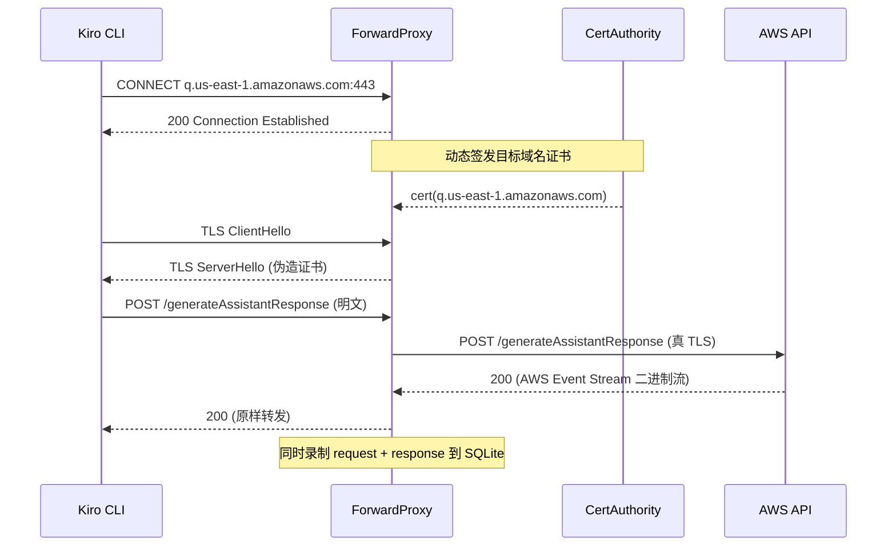
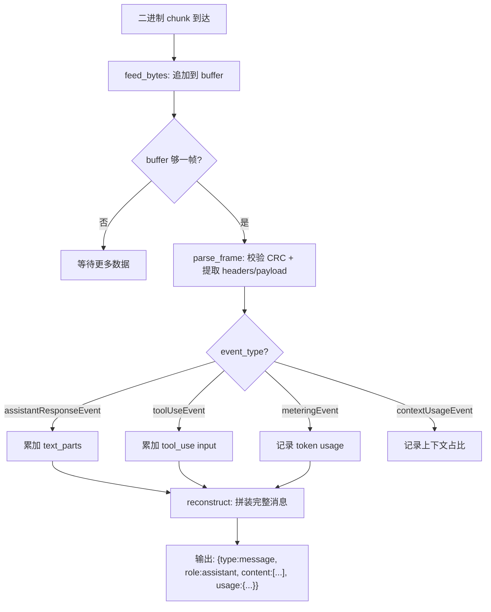

> **注：** 本文档由 **claude-sonnet-4-6** 模型自动生成。

# 📖 kiro-tap 源码全景解析

## 🌟 小白导读

**一句话大白话：** kiro-tap 就像是 Kiro AI 编程助手和 AWS 云端之间的"窃听器"——它在中间截获所有对话数据，让你能看到 Kiro 到底发了什么 prompt、用了多少 token、调用了哪些工具。

**生活类比：** 想象你在一家餐厅（Kiro）和厨房（AWS API）之间安装了一个透明的传菜窗口。所有点单（请求）和出菜（响应）都经过这个窗口，你可以在旁边的监控屏幕（Dashboard）上实时看到每道菜的配料清单、烹饪时间和成本。

**读前预期：**
- 读完"核心概念"后，你将能理解：Forward Proxy 如何透明拦截 HTTPS 流量
- 读完"源码剥洋葱"后，你将能看懂：AWS Event Stream 二进制协议如何被解析为可读消息
- 读完"难点突破"后，你将彻底搞清楚：TLS 中间人攻击的 loopback bounce 实现原理

---

## 📋 目录
- [项目概述与技术栈](#项目概述与技术栈)
- [目录结构](#目录结构)
- [架构全景（附生活类比）](#架构全景附生活类比)
- [入口与初始化流程](#入口与初始化流程)
- [关键业务流程图解](#关键业务流程图解)
- [核心源码剥洋葱（三层深度）](#核心源码剥洋葱三层深度)
- [错误处理与安全边界](#错误处理与安全边界)
- [关键类型与接口定义](#关键类型与接口定义)
- [难点突破（逐个攻克）](#难点突破逐个攻克)
- [为什么要这样设计？](#为什么要这样设计)
- [避坑指南](#避坑指南)

---

## 🎯 项目概述与技术栈

kiro-tap 是一个本地 MITM（中间人）代理工具，专门用于拦截和记录 Kiro CLI / Kiro IDE 与 AWS CodeWhisperer/Q API 之间的所有通信。开发者用它来研究 Kiro 的 context engineering（上下文工程）——包括 system prompt 结构、工具调用模式、token 消耗等。

**技术栈：**

| 技术/库 | 版本 | 在本项目中的具体角色 |
|---|---|---|
| Python | ≥3.11 | 运行时，利用 `asyncio` 实现高并发代理 |
| aiohttp | ≥3.9 | HTTP/WebSocket 反向代理 + Dashboard HTTP 服务器 |
| cryptography | ≥42.0 | 生成 CA 证书和 per-host TLS 证书（MITM 核心） |
| backports-zstd | ≥1.0 | 解压 Kiro 请求中的 zstd 编码 body |
| SQLite (stdlib) | — | 本地持久化所有 trace session、record、proxy log |
| setuptools-scm | ≥8.0 | 从 git tag 自动推导版本号 |

**核心特性：**
- Forward Proxy 模式：通过 CONNECT 隧道 + TLS 终止实现透明 HTTPS 拦截
- AWS Event Stream 二进制协议解析：Kiro 不用 SSE，用 AWS 私有二进制帧格式
- 实时 Dashboard：SSE 推送 + SPA 路由，浏览器实时查看对话流
- 多 session 共享 Dashboard：独立进程运行，多个 kiro-tap 实例共享同一个 UI
- 自动更新：启动时检查 PyPI，后台静默升级

---

## 📂 目录结构

```
kiro_tap/
├── __main__.py           # python -m kiro_tap 入口，调用 cli.main_entry()
├── __init__.py           # 包导出，聚合所有公共 API
├── cli.py                # CLI 参数解析 + async_main 主流程编排
├── forward_proxy.py      # Forward Proxy：CONNECT 隧道 + TLS MITM + 请求录制
├── proxy.py              # Reverse Proxy：aiohttp web handler + 请求录制
├── aws_event_stream.py   # AWS Event Stream 二进制帧解析器（Kiro 专用）
├── sse.py                # SSE 流重组器（Anthropic/OpenAI 协议）
├── certs.py              # CA 证书生成 + per-host 证书签发 + macOS 信任链
├── trace.py              # TraceWriter：异步写入 SQLite + 统计累加
├── trace_store.py        # SQLite schema 管理 + CRUD + legacy 迁移
├── trace_log_handler.py  # logging.Handler → SQLite proxy_logs 表
├── live.py               # LiveViewerServer：Dashboard HTTP + SSE 推送
├── shared_dashboard.py   # 共享 Dashboard 进程管理（spawn/health/lock）
├── dashboard.py          # Session 摘要计算 + agent 推断 + 预览提取
├── viewer.py             # HTML viewer 生成（嵌入 JSONL 数据的自包含页面）
├── ws_proxy.py           # WebSocket 双向中继 + 消息录制
├── history.py            # Trace 保留策略（清理旧 session）
├── usage.py              # Token usage 字段归一化（多 provider 兼容）
├── export.py             # 导出子命令：JSONL → Markdown/JSON/HTML
├── dashboard.html        # Dashboard SPA 前端（单文件，深色主题）
├── viewer.html           # Trace Viewer 前端（单文件，消息时间线）
└── viewer_i18n.json      # Viewer 多语言字符串
```

---

## 🏗️ 架构全景（附生活类比）

### 核心模块 1：ForwardProxyServer（forward_proxy.py）

**🗣️ 第一层 — 大白话**
- **它是啥**：一个 TCP 服务器，接收 Kiro 的 HTTPS 请求，假装自己是 AWS，解密流量后录制再转发
- **通俗点说**：就像邮局的"拆信检查员"——信（HTTPS）到了先拆开看内容，记录下来，再重新封好寄给收件人
- **没有它会怎样**：HTTPS 加密端到端，你根本看不到 Kiro 发了什么 prompt

**🔧 第二层 — 技术原理**
- **设计模式**：MITM Forward Proxy（CONNECT 隧道 + 动态证书签发）
- **为什么用这个模式**：Kiro 使用 OAuth 认证绑定到真实 AWS 域名，反向代理改 base URL 会破坏认证流程；Forward Proxy 让 Kiro 以为自己在直连 AWS
- **数据流链路**：Kiro → CONNECT q.us-east-1.amazonaws.com:443 → Proxy 回 200 → Proxy 用自签证书做 TLS → 读明文 HTTP → 转发到真 AWS → 录制 trace

**🔬 第三层 — 实现细节**
- **文件位置**：`kiro_tap/forward_proxy.py:127`
- **最容易忽略的细节**：TLS 终止不用 `loop.start_tls()`（macOS Python 3.11 不可靠），而是用 loopback bounce——在 127.0.0.1 起临时 TLS server，通过 socket relay 桥接

```python
# forward_proxy.py:318 — TLS loopback bounce 核心
# 💡 在本地起一个临时 TLS server，端口随机
tls_server = await asyncio.start_server(_accept_tls, "127.0.0.1", 0, ssl=ssl_ctx)
tls_port = tls_server.sockets[0].getsockname()[1]
# 💡 把原始客户端的字节流 relay 到这个本地 TLS server
relay_r, relay_w = await asyncio.open_connection("127.0.0.1", tls_port)
# 💡 两个 _pipe 协程双向搬运字节
relay_task = asyncio.create_task(_pipe(relay_r, writer))
client_to_relay_task = asyncio.create_task(_pipe(reader, relay_w))
```

> ⚠️ **常见误区**：以为可以直接 `start_tls()` 升级现有连接——macOS 上会 segfault 或静默失败

---

### 核心模块 2：AWSEventStreamReassembler（aws_event_stream.py）

**🗣️ 第一层 — 大白话**
- **它是啥**：把 Kiro 返回的二进制"碎片流"拼回完整的 AI 回复文本
- **通俗点说**：就像收到一堆打乱的拼图碎片（二进制帧），这个模块按编号拼回完整图画（assistant 消息）
- **没有它会怎样**：Dashboard 里只能看到一堆乱码 bytes，看不到 AI 说了什么

**🔧 第二层 — 技术原理**
- **设计模式**：流式累加器（Streaming Accumulator）
- **为什么不用 SSE**：Kiro/AWS 使用私有的 AWS Event Stream 二进制协议（`application/vnd.amazon.eventstream`），不是标准 SSE
- **数据流链路**：二进制 chunk → `feed_bytes()` → `parse_frame()` 提取帧 → 按 event_type 分发 → `reconstruct()` 输出完整消息

**🔬 第三层 — 实现细节**
- **文件位置**：`kiro_tap/aws_event_stream.py:267`
- **帧格式**：`[4B total_len][4B header_len][4B prelude_crc][headers][payload][4B msg_crc]`

```python
# aws_event_stream.py:173 — 解析单帧
# 💡 先读 12 字节 prelude（总长+头长+CRC）
total_length = struct.unpack_from(">I", buffer, 0)[0]
header_length = struct.unpack_from(">I", buffer, 4)[0]
prelude_crc = struct.unpack_from(">I", buffer, 8)[0]
# 💡 校验 prelude CRC（防止解析损坏数据）
actual_prelude_crc = _crc32(buffer[:8])
if actual_prelude_crc != prelude_crc:
    raise ValueError(f"Prelude CRC mismatch")
# 💡 提取 headers 和 payload
headers = _parse_headers(buffer[headers_start:headers_end])
payload = buffer[headers_end:total_length - 4]
```

> ⚠️ **常见误区**：以为 Kiro 用 SSE（`text/event-stream`）——实际是二进制协议，Content-Type 是 `application/vnd.amazon.eventstream`

---

### 核心模块 3：TraceStore（trace_store.py）

**🗣️ 第一层 — 大白话**
- **它是啥**：所有抓包数据的"数据库管家"，负责存取所有 session 和 record
- **通俗点说**：就像图书馆的管理系统——每次对话是一本书（session），每个 API 调用是一页（record），管家负责编目、存放、检索
- **没有它会怎样**：关掉 kiro-tap 后所有数据丢失，无法回看历史

**🔧 第二层 — 技术原理**
- **设计模式**：Singleton + Thread-local Connection Pool
- **为什么用 SQLite**：零配置、单文件、支持 WAL 并发读、适合本地工具
- **数据流链路**：TraceWriter.write() → store.append_record() → SQLite INSERT + UPDATE session 统计

**🔬 第三层 — 实现细节**
- **文件位置**：`kiro_tap/trace_store.py:56`
- **Schema 版本管理**：`PRAGMA user_version` 控制，当前 v3，支持从 v2 自动迁移

```python
# trace_store.py:660 — Thread-local 连接复用
# 💡 每个线程独立持有一个 SQLite 连接（避免跨线程共享）
def _connect(self) -> sqlite3.Connection:
    conn = getattr(self._tls, "conn", None)
    if conn is None:
        conn = self._open_connection()
        self._ensure_schema_once(conn)  # 💡 首次连接时建表
        self._tls.conn = conn
    return conn
```

> ⚠️ **常见误区**：以为可以多线程共享同一个 `sqlite3.Connection`——SQLite 的 connection 不是线程安全的

---

## 🚀 入口与初始化流程

程序启动时序（`kiro-tap` 命令）：

```python
# cli.py:1091 — main_entry() 入口分发
def main_entry() -> None:
    # 💡 子命令分发：export / update / trust-ca / dashboard 各走各的
    if sys.argv[1] == "export": ...
    if sys.argv[1] == "dashboard": ...
    # 💡 主流程：杀旧进程 → 解析参数 → asyncio.run(async_main)
    _kill_stale_kiro_tap_processes()
    args = parse_args()
    code = asyncio.run(async_main(args))
```

`async_main` 的初始化顺序（每一步都有依赖关系，不能乱序）：

1. **创建输出目录** + 迁移 legacy traces
2. **生成/加载 CA 证书**（forward 模式）→ 可选信任到 macOS keychain
3. **创建 SQLite session**（`store.create_session()`）→ 获得 `session_id`
4. **启动共享 Dashboard**（独立进程）→ 浏览器自动打开当前 session 页
5. **创建 TraceWriter**（绑定 session_id + store）
6. **配置 logging** → SQLiteLogHandler 写入 proxy_logs 表
7. **启动代理服务器**（Forward 或 Reverse 二选一）
8. **启动 Kiro 子进程**（设置 HTTPS_PROXY 环境变量指向本地代理）
9. **等待 Kiro 退出** → 清理资源 → 打印 token 统计

---

## 🗺️ 关键业务流程图解

### 流程一：Forward Proxy 拦截 HTTPS 请求



**👆 流程大白话翻译：**
1. Kiro 以为自己在直连 AWS，实际连的是本地代理
2. 代理假装是 AWS，用自签证书完成 TLS 握手
3. 握手后 Kiro 发送明文 HTTP，代理能看到所有内容
4. 代理把请求原样转发给真 AWS，把响应原样返回给 Kiro
5. 整个过程中，代理把请求和响应都存进 SQLite

**🔍 这个流程中最难理解的点**：为什么 Kiro 不会报证书错误？因为启动时通过 `SSL_CERT_FILE` 环境变量让 Kiro 信任了 kiro-tap 的 CA 证书，或者 CA 已被添加到 macOS login keychain。

---

### 流程二：AWS Event Stream 响应解析



**👆 流程大白话翻译：**
1. AWS 返回的不是文本，是一帧一帧的二进制数据包
2. 每帧有 CRC 校验（防损坏）、headers（标明事件类型）、payload（JSON 内容）
3. `assistantResponseEvent` 帧里是 AI 回复的文本碎片，拼起来就是完整回答
4. `toolUseEvent` 帧里是工具调用信息（函数名 + 参数）
5. 最后 `reconstruct()` 把所有碎片组装成一个标准化的消息对象

---

## 🔍 核心源码剥洋葱（三层深度）

> ⚠️ 每段代码 ≤15 行。省略用 `// ...省略: [说明省略了什么]` 标注。

### 解析一：流式响应的检测与分发

**📍 文件位置**：`kiro_tap/forward_proxy.py:511`

**第一层看懂它**：代理收到上游响应后，根据 Content-Type 判断是不是 AWS 二进制流，决定用哪种解析器。

```python
# 💡 从响应头提取 Content-Type
resp_content_type = upstream_resp.headers.get("Content-Type", "")
# 💡 检测是否为 AWS Event Stream 二进制协议
is_aws_eventstream = "application/vnd.amazon.eventstream" in resp_content_type
# 💡 关键判断：请求声明 stream=True 或响应是 eventstream，都走流式处理
if (is_streaming or is_aws_eventstream) and upstream_resp.status == 200:
    await self._handle_streaming(...)
else:
    await self._handle_non_streaming(...)
```

**第二层搞清楚它**：
- **用了什么技术**：Content-Type 嗅探 + 双条件 OR 判断
- **为什么不能只看 `stream` 字段**：Kiro 的请求 body 里没有 `stream: true` 字段！它总是返回 eventstream，不管你请求里写没写 stream。这是 v0.2.12 修复的 bug——之前只检查 `req_body.get("stream")`，导致 Kiro 响应被当作非流式处理，存成了不可解析的原始 bytes。

**第三层吃透它**：
- **最关键的一行**：`is_aws_eventstream = "application/vnd.amazon.eventstream" in resp_content_type`
- **改掉这行会发生什么**：Dashboard 的 Messages 区域将无法显示 Kiro 的 assistant 回复
- **底层追踪**：`_handle_streaming() → AWSEventStreamReassembler.feed_bytes() → parse_frame() → _process_event() → reconstruct()`

---

### 解析二：共享 Dashboard 的 session 路由

**📍 文件位置**：`kiro_tap/live.py:178`

**第一层看懂它**：用户打开 Dashboard 时，自动跳转到当前正在监听的 session 详情页，而不是显示历史列表。

```python
async def _handle_dashboard_index(self, request: web.Request) -> web.Response:
    # 💡 优先级1：URL 带 ?session_id= 参数（从 shared_dashboard 传入）
    if session_id := request.query.get("session_id"):
        raise web.HTTPFound(location=f"/dashboard/session/{quote(session_id, safe='')}")
    # 💡 优先级2：服务器自身持有 session_id（dashboard 子命令模式不会有）
    if self.session_id:
        raise web.HTTPFound(location=f"/dashboard/session/{quote(self.session_id, safe='')}")
    # 💡 优先级3：都没有，显示历史列表
    html = read_dashboard_template()
    html = self._inject_version(html)
    return web.Response(text=html, content_type="text/html")
```

**第二层搞清楚它**：
- **用了什么技术**：HTTP 302 重定向 + query param 传递 session context
- **为什么不直接用 self.session_id**：Dashboard 作为独立进程运行（`shared_dashboard.py` spawn），它没有当前 proxy session 的上下文。解决方案是 proxy 启动时把 session_id 编码到浏览器打开的 URL query 里。

**第三层吃透它**：
- **最关键的一行**：`raise web.HTTPFound(location=...)`
- **底层追踪**：`cli.async_main() → ensure_shared_dashboard(session_id=...) → _open_browser(url?session_id=xxx) → LiveViewerServer._handle_dashboard_index() → 302 redirect`

---

## 🛡️ 错误处理与安全边界

### 错误处理策略

kiro-tap 的错误处理遵循"代理透明"原则——代理自身的错误不能影响 Kiro 的正常工作。

**上游请求失败**（`forward_proxy.py:487`）：
```python
# 💡 上游不可达时，返回 502 给 Kiro，同时录制错误到 trace
except Exception as exc:
    error_text = str(exc)
    record = _build_record(..., 502, ..., {"error": error_text})
    await self._writer.write(record)  # 💡 错误也要录制，方便排查
    # 💡 给 Kiro 返回 502，让它知道请求失败了
    client_writer.write(b"HTTP/1.1 502 Bad Gateway\r\n...")
```

**流式传输中断**（`forward_proxy.py:580`）：
```python
# 💡 流式传输中连接断开，静默处理，不崩溃
try:
    async for chunk in upstream_resp.content.iter_any():
        client_writer.write(chunk_header + chunk + b"\r\n")
        reassembler.feed_bytes(chunk)
except (ConnectionError, asyncio.CancelledError):
    pass  # 💡 已收到的部分仍然会被 reconstruct()
```

**关键设计**：即使流中断，`reassembler.reconstruct()` 仍会返回已累积的部分内容，不会丢失已收到的数据。

### 边界输入校验

**路径白名单**（`proxy.py:86`）：反向代理模式下，只允许已知 API 路径通过，防止扫描器/爬虫滥用代理：

```python
ALLOWED_PATH_PREFIXES: tuple[str, ...] = (
    "/generateAssistantResponse",  # Kiro
    "/v1/messages",                # Anthropic
    "/v1/chat/completions",        # OpenAI
    # ...省略: 其他已知 API 路径
)
```

非白名单路径直接返回 404，不转发、不录制。

### 安全相关逻辑

**敏感 Header 脱敏**（`proxy.py:44`）：
- `Authorization`、`x-api-key`：只保留前 12 字符 + `...`
- `Cookie`、`Set-Cookie`：完全替换为 `***`
- Kiro 特有的 `cosy-key`、`cosy-machinetoken` 等：完全替换为 `***`

**CA 私钥保护**（`certs.py:103`）：
```python
ca_key_path.chmod(0o600)  # 💡 只有 owner 可读写
```

**非目标域名不拦截**（`forward_proxy.py:221`）：
```python
def _should_intercept(self, hostname: str) -> bool:
    # 💡 只 MITM 目标 API 域名，OAuth/auth 域名直接 TCP 透传
    target_host = _urlparse(self._local_reverse_target).hostname
    return hostname == target_host
```

这确保了 Kiro 的 OAuth 登录流程不被干扰——认证请求走 raw TCP passthrough，不做 TLS 终止。

---

## 📐 关键类型与接口定义

| 概念/类名 | 文件位置 | 在业务中代表什么 |
|---|---|---|
| `ForwardProxyServer` | `forward_proxy.py:127` | MITM 代理服务器，处理 CONNECT 隧道和 TLS 终止 |
| `CertificateAuthority` | `certs.py:183` | CA 证书管理器，按需为目标域名签发 TLS 证书 |
| `TraceWriter` | `trace.py:16` | 异步写入器，将 trace record 存入 SQLite 并累加统计 |
| `TraceStore` | `trace_store.py:56` | SQLite 数据访问层，管理 sessions/records/logs 三张表 |
| `AWSEventStreamReassembler` | `aws_event_stream.py:267` | AWS 二进制流解析器，拼装 Kiro 的流式响应 |
| `SSEReassembler` | `sse.py:12` | SSE 文本流解析器，拼装 Anthropic/OpenAI 的流式响应 |
| `LiveViewerServer` | `live.py:54` | Dashboard HTTP 服务器，提供 API + SSE 实时推送 |
| `SQLiteLogHandler` | `trace_log_handler.py:12` | logging Handler，将代理日志写入 SQLite |
| `ClientConfig` | `cli.py:67` | 客户端配置数据类，定义每种 AI CLI 的连接参数 |
| `Frame` | `aws_event_stream.py:63` | AWS Event Stream 单帧数据结构（headers + payload） |
| `_ToolUseAccumulator` | `aws_event_stream.py:247` | 工具调用累加器，拼装分片到达的 tool input JSON |

### 核心数据结构：Trace Record

每个 API 调用被录制为一个 `record` dict，结构如下：

```python
# proxy.py:416 — _build_record() 输出格式
{
    "timestamp": "2026-05-31T10:00:00+00:00",  # ISO 时间戳
    "request_id": "req_a1b2c3d4e5f6",          # 唯一请求 ID
    "turn": 3,                                  # 对话轮次
    "duration_ms": 1234,                        # 请求耗时
    "request": {
        "method": "POST",
        "path": "/generateAssistantResponse",
        "headers": {"Host": "q.us-east-1.amazonaws.com", ...},
        "body": {"messages": [...], "model": "..."},
    },
    "response": {
        "status": 200,
        "headers": {"Content-Type": "application/vnd.amazon.eventstream"},
        "body": {  # reconstruct() 的输出
            "type": "message",
            "role": "assistant",
            "content": [{"type": "text", "text": "..."}],
            "usage": {"input_tokens": 1000, "output_tokens": 500},
        },
        "sse_events": [...],  # 可选：原始流事件（--tap-store-stream-events）
    },
    "upstream_base_url": "https://q.us-east-1.amazonaws.com",
}
```

### SQLite Schema（v3）

```sql
-- sessions：每次 kiro-tap 运行产生一个 session
CREATE TABLE sessions (
    id TEXT PRIMARY KEY,           -- UUID
    started_at TEXT NOT NULL,      -- ISO timestamp
    updated_at TEXT NOT NULL,
    date_key TEXT NOT NULL,        -- "2026-05-31" 或 "legacy"
    client TEXT DEFAULT '',        -- "kiro" / "kiro-ide"
    proxy_mode TEXT DEFAULT '',    -- "forward" / "reverse"
    status TEXT DEFAULT 'active',  -- active/complete/error/empty
    record_count INTEGER DEFAULT 0,
    summary_json TEXT,             -- 缓存的 session 摘要 JSON
    legacy_source_key TEXT DEFAULT '',
    legacy_rel_path TEXT
);

-- records：每个 API 调用一行
CREATE TABLE records (
    session_id TEXT NOT NULL,
    record_index INTEGER NOT NULL,
    turn INTEGER,
    timestamp TEXT,
    payload_json TEXT NOT NULL,    -- 完整 record JSON
    PRIMARY KEY (session_id, record_index),
    FOREIGN KEY (session_id) REFERENCES sessions(id) ON DELETE CASCADE
);

-- proxy_logs：代理运行日志
CREATE TABLE proxy_logs (
    session_id TEXT NOT NULL,
    line_no INTEGER NOT NULL,
    logged_at TEXT,
    level TEXT,
    message TEXT NOT NULL,
    PRIMARY KEY (session_id, line_no),
    FOREIGN KEY (session_id) REFERENCES sessions(id) ON DELETE CASCADE
);
```

---

## 🧩 难点突破（逐个攻克）

> 以下是本项目中**所有难点**，逐一击破，绝不跳过。

### 难点 1：TLS Loopback Bounce（为什么不直接 start_tls）

**🤔 难在哪里**：Python 的 `loop.start_tls()` 在 macOS + Python 3.11 上不可靠（segfault 或静默失败），但我们需要在已建立的 TCP 连接上启动 TLS 服务端。

**💡 心智模型**：
想象你在打电话（TCP 连接已建立），现在需要切换到加密通话。直接在同一条线路上切换会出问题（start_tls 的 bug），所以你挂掉电话，让对方打到你旁边的加密电话机上（loopback TLS server），然后你在两台电话之间当翻译（relay）。

**🔗 实现追踪**（从调用方到底层，不断链）：
```
_handle_connect(authority, reader, writer)
  └─ 发送 "200 Connection Established"
      └─ _should_intercept(hostname) → True
          └─ ca.make_ssl_context(hostname)  ← 动态签发证书
              └─ asyncio.start_server(_accept_tls, "127.0.0.1", 0, ssl=ssl_ctx)
                  └─ asyncio.open_connection("127.0.0.1", tls_port)  ← 连接自己
                      └─ _pipe(relay_r, writer) + _pipe(reader, relay_w)  ← 双向搬运
                          └─ connected.wait()  ← TLS 握手完成
                              └─ _handle_tunneled_requests(tls_reader, tls_writer)
```

**⚠️ 常见陷阱**：
- 陷阱1：忘记 `await connected.wait()` 就开始读 tls_reader → 读到空数据
- 陷阱2：relay task 没有 cancel → 连接关闭后 task 泄漏

**✅ 正确姿势**：
```python
# 💡 必须等 TLS 握手完成再操作
await asyncio.wait_for(connected.wait(), timeout=15)
# 💡 finally 里必须 cancel 所有 relay task
finally:
    client_to_relay_task.cancel()
    await asyncio.gather(relay_task, client_to_relay_task, return_exceptions=True)
```

---

### 难点 2：共享 Dashboard 的进程间协调

**🤔 难在哪里**：多个 kiro-tap 实例可能同时启动，都想启动 Dashboard，但只能有一个实例运行在固定端口上。

**💡 心智模型**：
就像多个人同时想用同一个打印机——需要一个"排队锁"确保只有一个人在操作，其他人发现打印机已经在工作就直接用它。

**🔗 实现追踪**：
```
ensure_shared_dashboard()
  └─ is_dashboard_healthy(host, port)  ← 先检查是否已有实例
      └─ 有 → 直接用，打开浏览器
      └─ 无 → asyncio.to_thread(_spawn_dashboard_subprocess_if_needed)
          └─ _dashboard_spawn_lock()  ← 文件锁（fcntl.flock）
              └─ _sync_dashboard_healthy_for_current_db()  ← 双重检查
                  └─ 仍无 → _kill_process_on_port() + _spawn_dashboard_subprocess()
          └─ wait_for_dashboard_healthy(timeout=8s)  ← 轮询等待启动
```

**⚠️ 常见陷阱**：
- 陷阱1：不加文件锁 → 两个实例同时 spawn → 端口冲突
- 陷阱2：health check 只检查 HTTP 200 → 可能连到旧版本的 dashboard（DB 路径不同）

**✅ 正确姿势**：
```python
# 💡 health check 必须验证 db_path 一致
def _dashboard_health_matches_current_db(payload: dict | None) -> bool:
    return bool(payload and payload.get("ok") is True
                and payload.get("db_path") == str(resolve_db_path()))
```

---

### 难点 3：SSE 多协议兼容（Anthropic vs OpenAI vs Kiro）

**🤔 难在哪里**：三种 AI provider 的流式协议完全不同，但 trace viewer 需要统一展示。

**💡 心智模型**：
就像一个翻译官同时听三种语言的广播（Anthropic 的 event-based SSE、OpenAI 的 bare data SSE、Kiro 的二进制帧），需要把它们都翻译成同一种格式的笔记。

**🔗 实现追踪**：
```
响应到达
  └─ Content-Type 判断
      ├─ "application/vnd.amazon.eventstream" → AWSEventStreamReassembler
      └─ 其他 → SSEReassembler
          └─ _accumulate(event_type, data)
              ├─ "message_start" → 初始化 snapshot（Anthropic）
              ├─ "content_block_delta" → 累加文本（Anthropic）
              ├─ "response.completed" → 整体替换（OpenAI Responses）
              └─ "message" + "choices" → 累加 chat completion（OpenAI Chat）
```

**⚠️ 常见陷阱**：
- 陷阱1：OpenAI Chat Completions 没有 `event:` 行，只有 `data: {...}`——必须处理"无 event header"的情况
- 陷阱2：OpenAI 的 `[DONE]` 终止符不是 JSON——必须特殊跳过

**✅ 正确姿势**：
```python
# sse.py:40 — 处理无 event header 的情况
if self._current_event is not None or self._current_data_lines:
    raw_data = "\n".join(self._current_data_lines)
    if raw_data == "[DONE]" and self._current_event is None:
        return  # 💡 跳过 OpenAI 终止符
    event_type = self._current_event or "message"  # 💡 默认 "message"
```

---

### 难点 4：Kiro 子进程的终端控制权

**🤔 难在哪里**：Kiro CLI 是一个 TUI 应用（全屏终端 UI），需要完整的终端控制权（处理 Ctrl+Delete、Ctrl+U 等快捷键），但它是 kiro-tap 的子进程。

**💡 心智模型**：
就像你在电视上看直播（kiro-tap 是电视机），但直播里的嘉宾（Kiro）需要能直接操控摄像机（终端）——你得把遥控器交给嘉宾。

**🔗 实现追踪**：
```
run_client()
  └─ asyncio.create_subprocess_exec(*cmd, process_group=0)  ← 新进程组
      └─ os.tcsetpgrp(stdin.fileno(), proc.pid)  ← 交出前台控制权
          └─ proc.wait()  ← 等待 Kiro 退出
              └─ os.tcsetpgrp(stdin.fileno(), os.getpgrp())  ← 收回控制权
```

**⚠️ 常见陷阱**：
- 陷阱1：收回控制权时不屏蔽 SIGTTOU → 父进程被挂起
- 陷阱2：Ctrl+C 直接 kill → Kiro 来不及保存状态

**✅ 正确姿势**：
```python
# cli.py:297 — 收回终端时必须先忽略 SIGTTOU
old_sigttou = signal.signal(signal.SIGTTOU, signal.SIG_IGN)
try:
    os.tcsetpgrp(sys.stdin.fileno(), os.getpgrp())
except OSError:
    pass
signal.signal(signal.SIGTTOU, old_sigttou)
```

---

## 🎯 为什么要这样设计？（架构师碎碎念）

### 设计决策一：为什么用 Forward Proxy 而不是 Reverse Proxy？

- **当时面临的问题**：Kiro 使用 OAuth 认证，token 绑定到 `q.us-east-1.amazonaws.com` 域名。如果用反向代理改 base URL 为 `http://127.0.0.1:8080`，OAuth token 验证会失败。
- **有哪些备选方案**：
  - 方案A：Reverse Proxy（改 KIRO_BASE_URL）→ OAuth 失败
  - 方案B：Forward Proxy（设 HTTPS_PROXY）→ Kiro 以为直连 AWS，认证正常
  - 方案C：LD_PRELOAD hook → 侵入性太强，跨平台困难
- **最终选择的理由**：Forward Proxy 对 Kiro 完全透明，只需设置环境变量 + 信任 CA
- **这个选择的代价**：需要实现完整的 CONNECT 隧道 + TLS MITM，复杂度远高于反向代理

### 设计决策二：为什么 Dashboard 是独立进程？

- **当时面临的问题**：kiro-tap 的生命周期和 Kiro CLI 绑定——Kiro 退出，代理也退出。但用户可能想在 Kiro 退出后继续查看 trace。
- **有哪些备选方案**：
  - 方案A：Dashboard 内嵌在代理进程 → Kiro 退出后 Dashboard 也没了
  - 方案B：Dashboard 独立进程 + 共享 SQLite → 生命周期解耦
  - 方案C：生成静态 HTML 文件 → 无法实时更新
- **最终选择的理由**：独立进程 + SQLite WAL 模式允许并发读写，多个 kiro-tap 实例共享同一个 Dashboard
- **这个选择的代价**：需要进程间协调（文件锁、health check、端口占用检测）

### 设计决策三：为什么 Token Usage 需要 normalize_usage()？

- **当时面临的问题**：不同 AI provider 用不同字段名表示 token 用量
- **有哪些备选方案**：
  - 方案A：每个 provider 单独处理 → 代码重复，viewer 需要多套逻辑
  - 方案B：统一归一化层 → 一次转换，下游统一消费
- **最终选择的理由**：`normalize_usage()` 把 `prompt_tokens`/`promptTokenCount`/`input_tokens` 等全部映射到 `input_tokens`，下游代码只需读一种字段名
- **这个选择的代价**：新增 provider 时需要更新映射表

---

## ⚠️ 避坑指南

### 潜在风险

- **风险1**：CA 证书过期（5年有效期）→ **如何规避**：`ensure_ca()` 加载时会验证证书可用性，失败则自动重新生成
- **风险2**：SQLite WAL 文件膨胀（长时间运行不 checkpoint）→ **如何规避**：`cleanup_trace_sessions()` 在每次退出时清理旧 session，触发 SQLite 自动 checkpoint
- **风险3**：Dashboard 端口被其他程序占用 → **如何规避**：`_kill_process_on_port()` 在 spawn 前先杀占用进程；支持 `KIROTAP_DASHBOARD_PORT` 环境变量自定义端口
- **风险4**：Kiro 更新后改变 API 协议 → **如何规避**：Content-Type 嗅探而非硬编码判断；`iter_frames()` 遇到解析错误会跳过一字节重新同步，不会整体崩溃
- **风险5**：macOS Keychain 弹窗干扰自动化 → **如何规避**：`trust_macos_ca()` 不用 sudo，只写 login keychain；用户可以提前运行 `kiro-tap trust-ca` 一次性授权

### 优化建议

- **建议1**：`AWSEventStreamReassembler` 目前把所有 chunk 拼接到 `self._buf` 再逐帧解析，对于超大响应可以考虑 ring buffer 减少内存拷贝
- **建议2**：`_session_summary_from_row()` 在 summary 缓存缺失时会 `load_records()` 全量读取——对于有数百条 record 的 session，首次加载较慢，可以考虑只读 boundary records 做摘要
- **建议3**：Dashboard 的 SSE 推送目前是全量 session 变更通知，可以细化为 record-level diff 推送，减少前端重新渲染范围


