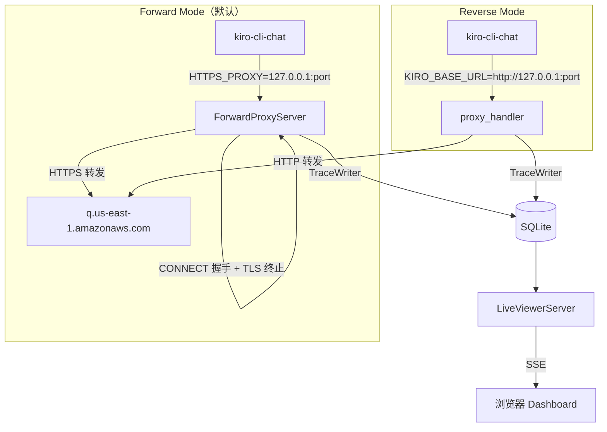
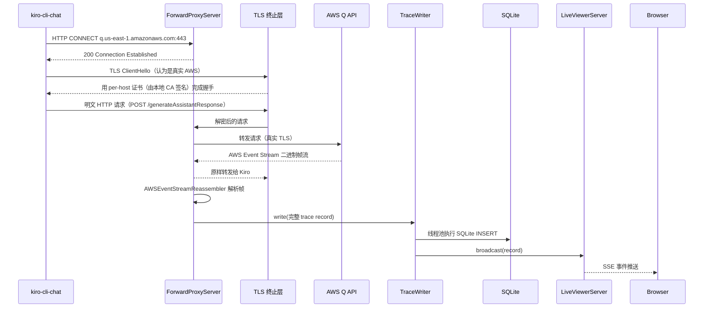
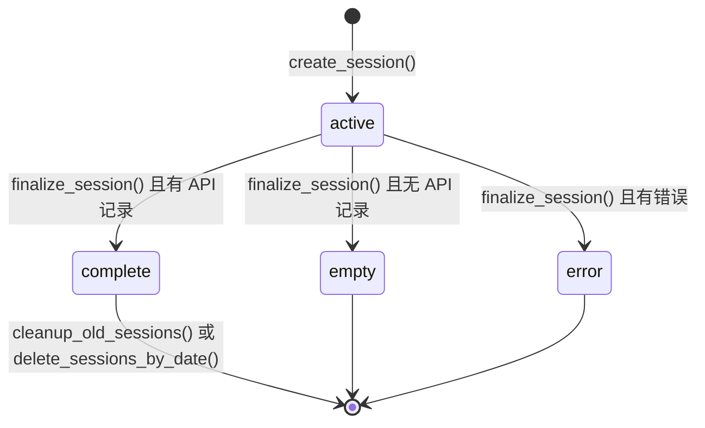

> **注：** 本文档由 **claude-sonnet-4-6** 模型自动生成。

# 📖 kiro-tap 源码全景解析

## 🌟 小白导读

**一句话大白话：** kiro-tap 就像一个"透明玻璃管道"——Kiro AI 工具和 AWS 服务器之间的所有请求都必须经过它，你可以通过玻璃看到里面流过的每一条消息。

**生活类比：** 就像给自来水管装了一个可视化流量计——水（数据）照常流动，但流量计会把每次的水量、水质、流速都记录到本地账本（SQLite），并在网页上实时显示。

**读前预期：**
- 读完"功能索引"后，你能立刻定位到任何功能的代码位置
- 读完"核心架构"后，你能理解两种代理模式的设计取舍
- 读完"数据流"后，你能追踪一条请求从进入代理到写入数据库的完整链路

---

## 📋 目录
- [项目概述与技术栈](#项目概述与技术栈)
- [目录结构](#目录结构)
- [⚡ 功能-代码速查索引（核心）](#功能代码速查索引核心)
- [架构全景：双代理模式](#架构全景双代理模式)
- [关键业务流程图解](#关键业务流程图解)
- [核心源码剥洋葱](#核心源码剥洋葱)
- [错误处理与安全边界](#错误处理与安全边界)
- [关键类型与接口定义](#关键类型与接口定义)
- [难点突破](#难点突破)
- [为什么要这样设计](#为什么要这样设计)
- [避坑指南](#避坑指南)

---

## 🎯 项目概述与技术栈

kiro-tap 是一个 Python CLI 工具，通过本地代理拦截 Kiro CLI / Kiro IDE 与 AWS Q API 之间的所有 HTTPS 流量，实时解析 AWS Event Stream 二进制帧，将 API 请求/响应持久化到本地 SQLite，并通过浏览器 Dashboard 实时展示。发布在 PyPI，版本由 `setuptools-scm` 从 git tag 自动推导。

**技术栈：**

| 技术/库 | 版本 | 在本项目中的具体角色 |
|---|---|---|
| Python | 3.11+ | 运行时；`asyncio` 驱动全部异步 I/O |
| aiohttp | ≥3.9 | 反向代理模式的 HTTP 服务器；向上游转发请求；LiveViewerServer 的 Web 框架 |
| cryptography | ≥42.0 | 生成本地 CA 证书和按域名签名的 TLS 证书（MITM 核心） |
| backports-zstd | ≥1.0 | Python<3.14 的 zstd 解压支持（Kiro 响应可能使用 zstd） |
| SQLite (stdlib) | — | 持久化 trace sessions、API records、proxy logs；单文件数据库 |
| setuptools-scm | ≥8.0 | 从 git tag `v*` 自动推导版本号，无需手动维护 |

**核心特性：**
- 正向代理（Forward）模式：CONNECT 隧道 + TLS 终止，无需修改 Kiro 客户端
- AWS Event Stream 二进制帧完整解析（CRC32 + 所有 Header 类型）
- 多 AI 客户端支持（Kiro CLI、Kiro IDE，架构可扩展到 Claude Code、Codex 等）
- 共享 Dashboard 进程（多个 kiro-tap 实例复用同一端口 19528）
- 敏感 Header 自动脱敏，数据不离本机

---

## 📂 目录结构

```
kiro-tap/
├── kiro_tap/
│   ├── __init__.py          # 公开 API 入口，re-export 所有关键符号
│   ├── __main__.py          # python -m kiro_tap 入口
│   ├── cli.py               # 主入口 main_entry()，所有子命令解析与调度
│   ├── forward_proxy.py     # ForwardProxyServer：TCP + CONNECT + TLS 终止
│   ├── proxy.py             # proxy_handler：aiohttp 反向代理处理器
│   ├── aws_event_stream.py  # AWS Event Stream 二进制帧解析器（Kiro 专用）
│   ├── sse.py               # SSEReassembler：标准 SSE 文本流重建器
│   ├── ws_proxy.py          # WebSocket 代理：双向消息转发与录制
│   ├── trace.py             # TraceWriter：异步写入器，累计统计
│   ├── trace_store.py       # TraceStore：SQLite 单例，线程安全
│   ├── trace_log_handler.py # SQLiteLogHandler：日志 → SQLite
│   ├── live.py              # LiveViewerServer：Dashboard HTTP+SSE 服务
│   ├── shared_dashboard.py  # Dashboard 进程管理（跨会话共享）
│   ├── dashboard.py         # SQLite 查询帮助器 + dashboard.html 加载
│   ├── viewer.py            # 自包含 HTML 查看器生成器
│   ├── export.py            # export 子命令：JSONL → Markdown/JSON/HTML
│   ├── certs.py             # CA 证书生成、macOS 钥匙串信任
│   ├── history.py           # Session 清理 + legacy JSONL 迁移
│   ├── usage.py             # Token 用量字段标准化（跨 provider）
│   ├── dashboard.html       # Dashboard 前端（打包进 wheel）
│   └── viewer.html          # Viewer 前端（打包进 wheel）
├── tests/
│   ├── conftest.py          # pytest 配置，--run-real-e2e 标志
│   ├── test_aws_event_stream.py
│   ├── test_audit_batch_3.py
│   ├── test_kiro_launch.py
│   └── test_path_allowlist.py
├── pyproject.toml           # 构建配置，依赖，ruff/pytest/coverage 设置
└── .github/workflows/publish.yml  # tag v* → PyPI 发布流水线
```

---

## ⚡ 功能-代码速查索引（核心）

> 这是最重要的章节。按功能描述查找，直接跳到对应 `文件:行号`。

### 一、入口与启动

| 功能 | 文件:行号 | 说明 |
|---|---|---|
| CLI 主入口 | `kiro_tap/cli.py:1112` | `main_entry()` — 子命令分发，最终调 `async_main` |
| 解析 `--tap-*` 参数 | `kiro_tap/cli.py:664` | `parse_args()` — 提取自身参数，其余透传给客户端 |
| 启动代理 + 会话生命周期 | `kiro_tap/cli.py:435` | `async_main()` — 创建 session、启动代理、结束后打印摘要 |
| 启动 Kiro 客户端子进程 | `kiro_tap/cli.py:151` | `run_client()` — 注入环境变量、信号处理、等待退出 |
| 客户端配置（命令/URL/模式） | `kiro_tap/cli.py:129` | `CLIENT_CONFIGS` — `kiro` 和 `kiro-ide` 的完整配置字典 |
| `ClientConfig` 数据类 | `kiro_tap/cli.py:67` | 每个客户端的参数结构体 |
| `dashboard` 子命令 | `kiro_tap/cli.py:901` | `dashboard_main()` — 启动独立 Dashboard 进程 |
| `export` 子命令入口 | `kiro_tap/export.py:1` | `export_main()` — JSONL/SQLite → MD/JSON/HTML |
| `update` 子命令 | `kiro_tap/cli.py:1071` | `update_main()` — 检测安装器（uv/pip）并升级 |
| `trust-ca` 子命令 | `kiro_tap/cli.py:1105` | `trust_ca_main()` — macOS 钥匙串信任 CA |
| PyPI 版本检查 | `kiro_tap/cli.py:998` | `_check_pypi_version()` — 异步 HTTP 查询 PyPI |

### 二、正向代理（Forward Proxy）

| 功能 | 文件:行号 | 说明 |
|---|---|---|
| ForwardProxyServer 类 | `kiro_tap/forward_proxy.py:141` | 整个正向代理的主类 |
| 启动 TCP 服务器 | `kiro_tap/forward_proxy.py:169` | `start()` — `asyncio.start_server`，返回实际端口 |
| 处理 CONNECT 请求 | `kiro_tap/forward_proxy.py` | `_handle_client()` → 解析 CONNECT → TLS 终止 |
| 读取 HTTP 请求体（分块编码） | `kiro_tap/forward_proxy.py:66` | `_read_chunked_body()` |
| 读取 HTTP 请求体（Content-Length） | `kiro_tap/forward_proxy.py:92` | `_read_http_body()` |
| 检测 WebSocket 升级 | `kiro_tap/forward_proxy.py:128` | `_is_websocket_upgrade()` |
| 构造 WS Accept Header | `kiro_tap/forward_proxy.py:136` | `_build_ws_accept()` — SHA1+base64 握手计算 |
| 路径前缀白名单检查（forward） | `kiro_tap/forward_proxy.py:59` | `_matches_path_prefix()` |

### 三、反向代理（Reverse Proxy）

| 功能 | 文件:行号 | 说明 |
|---|---|---|
| 反向代理请求处理器 | `kiro_tap/proxy.py:167` | `proxy_handler()` — aiohttp handler，路径检查→转发→录制 |
| 路径白名单 | `kiro_tap/proxy.py:86` | `ALLOWED_PATH_PREFIXES` — 所有允许的 API 路径前缀 |
| 路径白名单检查函数 | `kiro_tap/proxy.py:120` | `_is_allowed_path()` |
| 流式响应处理 | `kiro_tap/proxy.py:295` | `_handle_streaming()` — 边转发边喂给 Reassembler |
| 非流式响应处理 | `kiro_tap/proxy.py:369` | `_handle_non_streaming()` |
| 构建 Trace Record | `kiro_tap/proxy.py:424` | `_build_record()` — 组装最终存储的 dict |
| Header 过滤（跳过 hop-by-hop） | `kiro_tap/proxy.py:66` | `filter_headers()` — 同时支持敏感 header 脱敏 |
| 敏感 Header 列表 | `kiro_tap/proxy.py:44` | `SENSITIVE_HEADER_KEYS` |
| DeepSeek 兼容性修复 | `kiro_tap/proxy.py:141` | `_normalize_request_body_for_upstream()` |

### 四、AWS Event Stream 解析

| 功能 | 文件:行号 | 说明 |
|---|---|---|
| Frame 数据类 | `kiro_tap/aws_event_stream.py:64` | `Frame` — headers dict + payload bytes |
| CRC32 校验 | `kiro_tap/aws_event_stream.py:33` | `_crc32()` — `zlib.crc32` 包装 |
| 解析单个 Header 值 | `kiro_tap/aws_event_stream.py:95` | `_parse_header_value()` — 支持 9 种类型 |
| 解析全部 Headers | `kiro_tap/aws_event_stream.py:157` | `_parse_headers()` |
| 从字节流迭代帧 | `kiro_tap/aws_event_stream.py` | `iter_frames()` — 生成器，CRC 校验 + 切分 |
| AWSEventStreamReassembler | `kiro_tap/aws_event_stream.py` | 喂字节 → 缓冲 → 解帧 → 重建完整响应 |
| 协议常量（帧结构大小） | `kiro_tap/aws_event_stream.py:52` | `PRELUDE_SIZE=12`, `MIN_MESSAGE_SIZE=16`, `MAX_MESSAGE_SIZE=16MB` |
| Header 类型常量 | `kiro_tap/aws_event_stream.py:40` | `_HEADER_TYPE_BOOL_TRUE` … `_HEADER_TYPE_UUID` |

### 五、SSE 标准流解析

| 功能 | 文件:行号 | 说明 |
|---|---|---|
| SSEReassembler 类 | `kiro_tap/sse.py:19` | 标准 SSE 流（Anthropic/OpenAI） + OpenAI Chat Completions |
| 喂入原始字节 | `kiro_tap/sse.py:31` | `feed_bytes()` — 按 `\n` 切行，防 OOM（64MB 上限） |
| 解析单行 SSE | `kiro_tap/sse.py:47` | `_feed_line()` — 处理 `event:` / `data:` / 空行 |
| 累积 Anthropic 流 | `kiro_tap/sse.py:85` | `_accumulate()` — `message_start/content_block_*/message_delta` |
| 累积 OpenAI Chat Completions | `kiro_tap/sse.py:154` | `_accumulate_chat_completion_chunk()` |
| 工具调用镜像到 content | `kiro_tap/sse.py:241` | `_mirror_tool_call_to_content()` |
| 重建最终响应对象 | `kiro_tap/sse.py:298` | `reconstruct()` — 返回完整的 message snapshot |

### 六、TLS 证书与 CA 管理

| 功能 | 文件:行号 | 说明 |
|---|---|---|
| 确保 CA 存在（首次生成） | `kiro_tap/certs.py:38` | `ensure_ca()` — 返回 `(ca_cert_path, ca_key_path)` |
| CA 默认路径 | `kiro_tap/certs.py:26` | `~/.kiro-tap/ca.pem` + `~/.kiro-tap/ca-key.pem` |
| CertificateAuthority 类 | `kiro_tap/certs.py:188` | 内存缓存的 per-host 证书工厂 |
| 生成 per-host 证书 | `kiro_tap/certs.py:199` | `get_host_cert_pem()` — 按域名签名，结果缓存 |
| 创建 SSL Context | `kiro_tap/certs.py:262` | `make_ssl_context()` — 写临时文件加载，删除后缓存 context |
| 检查 macOS 钥匙串信任 | `kiro_tap/certs.py:156` | `is_macos_ca_trusted()` — `security verify-cert` |
| 写入 macOS 钥匙串信任 | `kiro_tap/certs.py:167` | `trust_macos_ca()` — `security add-trusted-cert`，无需 sudo |

### 七、Trace 存储（SQLite）

| 功能 | 文件:行号 | 说明 |
|---|---|---|
| TraceStore 类 | `kiro_tap/trace_store.py:56` | SQLite 单例，线程安全（`RLock` + thread-local 连接） |
| 解析 DB 路径 | `kiro_tap/trace_store.py:25` | `resolve_db_path()` — `~/.local/share/kiro-tap/traces.sqlite3`，可用 `KIROTAP_DB` 覆盖 |
| 获取进程单例 | `kiro_tap/trace_store.py:38` | `get_trace_store()` |
| 测试用重置单例 | `kiro_tap/trace_store.py:47` | `reset_trace_store()` |
| 创建 Session | `kiro_tap/trace_store.py:67` | `create_session()` — 插入 `sessions` 表，返回 UUID |
| 追加 API Record | `kiro_tap/trace_store.py:93` | `append_record()` — JSON 序列化存入 `records` 表 |
| 追加代理日志 | `kiro_tap/trace_store.py:128` | `append_log()` — 存入 `proxy_logs` 表 |
| 结束 Session | `kiro_tap/trace_store.py:161` | `finalize_session()` — 更新状态为 complete/error/empty |
| 清理旧 Session | `kiro_tap/history.py:23` | `cleanup_trace_sessions(max_sessions)` |
| 按日期删除 Session | `kiro_tap/history.py:10` | `delete_trace_history(date_key)` |
| 迁移旧 JSONL 文件 | `kiro_tap/history.py:28` | `migrate_legacy_traces(output_dir)` |
| Schema 版本 | `kiro_tap/trace_store.py:17` | `SCHEMA_VERSION = 3` |

### 八、TraceWriter（异步写入层）

| 功能 | 文件:行号 | 说明 |
|---|---|---|
| TraceWriter 类 | `kiro_tap/trace.py:15` | 异步包装 TraceStore，累计 token 统计 |
| 异步写入 record | `kiro_tap/trace.py:38` | `write()` — 线程池执行 SQLite 写，广播到 LiveViewerServer |
| 关闭并持久化摘要 | `kiro_tap/trace.py:54` | `close()` — 调用 `finalize_session` |
| 更新 token 统计 | `kiro_tap/trace.py:59` | `_update_stats()` |
| 获取会话摘要 | `kiro_tap/trace.py` | `get_summary()` — 返回 api_calls / tokens 字典 |

### 九、日志持久化

| 功能 | 文件:行号 | 说明 |
|---|---|---|
| SQLiteLogHandler | `kiro_tap/trace_log_handler.py:11` | `logging.Handler` 子类，把代理日志写进 SQLite |
| emit 实现 | `kiro_tap/trace_log_handler.py:19` | 格式化 + 异常信息 → `store.append_log()` |

### 十、Dashboard / Live Viewer

| 功能 | 文件:行号 | 说明 |
|---|---|---|
| LiveViewerServer 类 | `kiro_tap/live.py:78` | Dashboard HTTP 服务器（aiohttp） |
| 启动服务器 + 注册路由 | `kiro_tap/live.py:105` | `start()` — 注册所有路由，启动定时器 |
| SSE 事件流（实时推送） | `kiro_tap/live.py` | `_handle_sse()` — 新连接收到全量历史 + 订阅新事件 |
| Dashboard 主页 | `kiro_tap/live.py` | `_handle_dashboard_index()` |
| 单 Session 详情 | `kiro_tap/live.py` | `_handle_dashboard_session_detail()` |
| Session Records API | `kiro_tap/live.py` | `GET /api/sessions/{id}/records` |
| 导出 JSONL API | `kiro_tap/live.py` | `GET /api/sessions/{id}/export/jsonl` |
| 同源检查（防 CSRF） | `kiro_tap/live.py:31` | `_is_same_origin()` — `Sec-Fetch-Site` + `Origin` 双重校验 |
| 共享 Dashboard 进程管理 | `kiro_tap/shared_dashboard.py:1` | `ensure_shared_dashboard()` — 复用或新建进程 |
| Dashboard 健康检查 | `kiro_tap/shared_dashboard.py` | `is_dashboard_healthy()` + `is_legacy_dashboard_healthy()` |
| Dashboard 默认端口 | `kiro_tap/shared_dashboard.py:21` | `DEFAULT_DASHBOARD_PORT = 19528` |
| Dashboard 端口解析 | `kiro_tap/shared_dashboard.py:27` | `resolve_dashboard_port()` — 支持 `KIROTAP_DASHBOARD_PORT` 覆盖 |

### 十一、HTML Viewer 生成

| 功能 | 文件:行号 | 说明 |
|---|---|---|
| 生成自包含 HTML | `kiro_tap/viewer.py` | `_generate_html_viewer()` — 把 trace 数据注入 viewer.html |
| 读取 viewer 模板 | `kiro_tap/viewer.py:42` | `_read_viewer_template()` — 注入 i18n 脚本 |
| 懒加载阈值 | `kiro_tap/viewer.py:19` | `LAZY_THRESHOLD = 50` — 超过 50 条记录启用懒渲染 |
| i18n 数据加载 | `kiro_tap/viewer.py:25` | `_load_viewer_i18n()` — 从 `viewer_i18n.json` 读取 8 种语言 |
| 标准化 record 格式 | `kiro_tap/viewer.py` | `_normalize_record_for_viewer()` |
| 提取 SSE/WS 事件 | `kiro_tap/viewer.py:53` | `_iter_response_events()` |

### 十二、WebSocket 代理

| 功能 | 文件:行号 | 说明 |
|---|---|---|
| WS 代理主处理器 | `kiro_tap/ws_proxy.py:62` | `_handle_websocket()` — 双向消息转发 + 录制 |
| 解析环境代理配置 | `kiro_tap/ws_proxy.py:40` | `_get_ws_proxy_settings()` — wss/ws URL 转换后查 env |
| 重建 WS 请求体 | `kiro_tap/ws_proxy.py` | `reconstruct_ws_request_body()` |
| 重建 WS 响应体 | `kiro_tap/ws_proxy.py` | `reconstruct_ws_response_body()` |

### 十三、Token 用量归一化

| 功能 | 文件:行号 | 说明 |
|---|---|---|
| 跨 provider 归一化 | `kiro_tap/usage.py:6` | `normalize_usage()` — 统一 `input_tokens`/`output_tokens`/`cache_*` 字段名 |
| 支持的字段别名 | `kiro_tap/usage.py:11` | `prompt_tokens`→`input_tokens`，`completion_tokens`→`output_tokens`，`cached_tokens`→`cache_read_input_tokens` 等 |

### 十四、环境变量速查

| 环境变量 | 默认值 | 作用 |
|---|---|---|
| `KIROTAP_DB` | `~/.local/share/kiro-tap/traces.sqlite3` | 覆盖 SQLite 数据库路径（测试隔离用） |
| `KIROTAP_DASHBOARD_PORT` | `19528` | 覆盖 Dashboard 端口 |
| `KIROTAP_PYPI_URL` | PyPI API | 覆盖更新检查 URL（离线测试用） |
| `HTTPS_PROXY` / `https_proxy` | — | 上游代理（kiro-tap 自身发出的请求走此代理） |
| `NO_PROXY` / `no_proxy` | — | kiro-tap 自动追加 `localhost,127.0.0.1,::1` |

---

## 🏗️ 架构全景：双代理模式

### 正向代理（Forward）vs 反向代理（Reverse）

**🗣️ 大白话**
- **Reverse**：让 Kiro 把你当作"假的 AWS 服务器"——Kiro 请求你，你再转发给真 AWS
- **Forward**：让你当"网络快递中转站"——Kiro 照常发快递去 AWS，但所有快递都必须经过你的中转站（CONNECT + TLS 拆包查看）

**🔧 技术原理**
- Reverse 需要 Kiro 支持 `KIRO_BASE_URL` 环境变量才能重定向；Kiro CLI 支持，但**当前代码设置两种客户端都用 forward 模式**（`default_proxy_mode="forward"`）
- Forward 通过注入 `HTTPS_PROXY` 环境变量实现，无需 Kiro 有任何特殊支持



---

## 🗺️ 关键业务流程图解

### 流程一：正向代理请求全链路



**👆 流程大白话翻译：**
1. Kiro 以为自己在连接真实的 AWS，但实际先经过 kiro-tap 的 CONNECT 代理
2. kiro-tap 用自己生成的本地 CA 签一张"假的 AWS 证书"给 Kiro，Kiro 信任它（因为 `SSL_CERT_FILE` 被注入）
3. kiro-tap 解密并查看请求内容，再用真实证书连接 AWS 转发
4. 响应（AWS Event Stream 二进制）原样转给 Kiro，同时被解析、存储、推送到浏览器

**🔍 最难理解的点**：为什么 Kiro 会信任假证书？因为 `run_client()` 在启动子进程时注入了 `SSL_CERT_FILE=/path/to/kiro-tap/ca.pem`（`cli.py:188`），让 Python 的 SSL 层只信任这个 CA。

### 流程二：会话生命周期



---

## 🔍 核心源码剥洋葱

### 解析一：AWS Event Stream 帧结构（`aws_event_stream.py`）

**📍 文件位置**：`kiro_tap/aws_event_stream.py:52`

**第一层**：Kiro 的响应不是普通文本，而是一个个"二进制信封"——每个信封有固定头部说明大小，里面装着 JSON 内容，信封末尾有"防伪码"（CRC32）。

```python
# aws_event_stream.py:52 — 帧结构常量
PRELUDE_SIZE = 12   # 💡 前 12 字节固定：total_len(4) + header_len(4) + prelude_crc(4)
MIN_MESSAGE_SIZE = PRELUDE_SIZE + 4   # 💡 最小帧 = 前缀 + 消息 CRC(4)
MAX_MESSAGE_SIZE = 16 * 1024 * 1024  # 💡 单帧上限 16MB，防 OOM

# _crc32(): 用 zlib.crc32 计算 ISO-HDLC CRC，与 AWS SDK 算法一致
def _crc32(data: bytes) -> int:
    return zlib.crc32(data) & 0xFFFFFFFF  # 💡 & 0xFFFFFFFF 保证无符号 32 位
```

**第二层**：解析器用滑动缓冲区 `_buf` 积攒字节，满足 `PRELUDE_SIZE` 后读总长度，再等到完整帧到来才解析，CRC 校验失败直接丢帧。

**底层追踪**：
```
proxy.py _handle_streaming()
  → reassembler.feed_bytes(chunk)          # AWSEventStreamReassembler
      → 积攒到 _buf
      → iter_frames(_buf)                  # 生成器切帧
          → _parse_headers(header_bytes)   # 解析 9 种 header 类型
          → Frame(headers, payload)
      → _accumulate_frame(frame)           # 按 event_type 组装响应
          → "assistantResponseEvent" → 拼接文本
          → "meteringEvent" → 提取 token 用量
```

---

### 解析二：TraceWriter 的线程安全写入（`trace.py`）

**📍 文件位置**：`kiro_tap/trace.py:38`

**第一层**：kiro-tap 全程用 asyncio，但 SQLite 是阻塞 I/O——直接调用会卡死事件循环。解决方案：把 SQLite 操作扔到线程池执行。

```python
# trace.py:38 — 异步写入
async def write(self, record: dict) -> None:
    async with self._lock:  # 💡 asyncio.Lock 保证记录顺序
        loop = asyncio.get_running_loop()
        await loop.run_in_executor(   # 💡 关键：把阻塞调用移出事件循环
            None,                      # 💡 None = 使用默认线程池
            self._store.append_record, # 💡 这个函数会阻塞，但在线程里跑
            self.session_id,
            record
        )
        self.count += 1
        self._update_stats(record)   # 💡 统计必须在 lock 内，保证一致性
    # 💡 广播在 lock 外，避免持锁时做 I/O
    if self._live_server:
        await self._live_server.broadcast(record)
```

**最容易踩的坑**：`TraceStore` 内部用的是 `threading.RLock`（不是 asyncio.Lock），因为它在线程池中运行。`RLock` 允许同一线程重入——`SQLiteLogHandler.emit()` 在写日志时可能递归调用 `append_log`，普通 `Lock` 会死锁，`RLock` 不会。

---

## 🛡️ 错误处理与安全边界

### 路径白名单（最重要的安全机制）

`proxy.py:86` 的 `ALLOWED_PATH_PREFIXES` 是代理的安全门卫。任何不在白名单的路径直接返回 404，**不转发、不记录**。这防止有人把代理当作任意 HTTP 跳板。

```python
# proxy.py:120
def _is_allowed_path(path: str, extra_prefixes: tuple[str, ...] = ()) -> bool:
    clean = path.split("?", 1)[0].rstrip("/")  # 💡 去掉 query string 和末尾斜杠
    prefixes = ALLOWED_PATH_PREFIXES + extra_prefixes
    return any(
        clean == prefix
        or clean.startswith(prefix + "/")   # 💡 /v1/messages/foo 也允许
        or clean.startswith(prefix + ":")   # 💡 /v1/messages:stream 等 RPC 格式
        for prefix in prefixes
    )
```

### 敏感 Header 脱敏

`proxy.py:44` 的 `SENSITIVE_HEADER_KEYS` 在 `filter_headers(redact_keys=True)` 时生效：
- `authorization`、`x-api-key`：保留前 12 字符 + `...`（方便调试时确认 key 前缀）
- `cookie`、`cosy-*` 系列：完全替换为 `***`

### SSE/AWS 缓冲区 OOM 防护

- `SSEReassembler._buf`：超过 64MB 直接清空缓冲并打 warning（`sse.py:33`）
- `AWSEventStreamReassembler._buf`：同样的 64MB 上限
- `content_block_start` 的 `index` 字段：超过 `_MAX_CONTENT_INDEX=10000` 的直接忽略

### 非本机绑定警告

`cli.py:515` — 绑定到非 loopback 地址时打印安全警告，提示代理无认证且可被滥用为开放中继。

---

## 📐 关键类型与接口定义

| 类型/常量 | 文件位置 | 业务含义 |
|---|---|---|
| `ClientConfig` | `cli.py:67` | 描述一个受支持的 AI 客户端的完整配置（命令名、base URL、代理模式等） |
| `CLIENT_CONFIGS` | `cli.py:129` | `{"kiro": ..., "kiro-ide": ...}` 的配置字典 |
| `Frame` | `aws_event_stream.py:64` | 一个解析后的 AWS Event Stream 帧，含 headers dict 和 payload bytes |
| `TraceStore` | `trace_store.py:56` | 持久层单例；每个 session 是 SQLite `sessions` 表的一行 |
| `TraceWriter` | `trace.py:15` | 每个代理运行期间的写入实例；持有 session_id 和累计统计 |
| `CertificateAuthority` | `certs.py:188` | 进程内存中的 CA，`_host_cache` 缓存 per-host 证书，`_ssl_ctx_cache` 缓存 SSLContext |
| `LiveViewerServer` | `live.py:78` | aiohttp web 服务器；`_sse_clients` 是当前连接的 SSE 订阅者列表 |
| `ForwardProxyServer` | `forward_proxy.py:141` | TCP 服务器；`_client_tasks` 追踪所有活跃连接任务 |
| `ALLOWED_PATH_PREFIXES` | `proxy.py:86` | `tuple[str, ...]` — 路径白名单，增加新 API 支持时在此追加 |
| `SENSITIVE_HEADER_KEYS` | `proxy.py:44` | `frozenset[str]` — 需要脱敏的 header 名（全小写） |
| `SCHEMA_VERSION` | `trace_store.py:17` | SQLite schema 版本号，当前为 3；升级时触发 migration |

---

## 🧩 难点突破

### 难点 1：为什么 Kiro 会信任假 TLS 证书？

**难在哪里**：Kiro 客户端本该验证 AWS 证书的合法性，kiro-tap 怎么骗过它？

**心智模型**：就像海关查护照——海关（Kiro）只认特定签发机构（CA）的证件。kiro-tap 自己当了一个"私人签证机构"，然后通过环境变量 `SSL_CERT_FILE` 告诉 Kiro"只认我这家机构签发的证件"。

**实现追踪**：
```
cli.py:447  ensure_ca()  →  生成/读取 ~/.kiro-tap/ca.pem
cli.py:188  env["SSL_CERT_FILE"] = str(ca_cert_path)  →  注入子进程环境
kiro-cli-chat 启动，Python SSL 层加载 SSL_CERT_FILE 指定的 CA
certs.py:262  make_ssl_context(hostname)  →  用 CA 签一张 per-host 证书
forward_proxy.py  TLS 握手时用此 context 响应客户端
```

**✅ 正确姿势**：如果要支持非 Python 客户端（如原生 macOS App），SSL_CERT_FILE 无效，需要调用 `trust_macos_ca()` 把 CA 写入系统钥匙串。

---

### 难点 2：共享 Dashboard 进程如何保证只有一个？

**难在哪里**：多个 kiro-tap 实例同时启动，都想占 19528 端口。

**心智模型**：就像多个人同时想预定同一个会议室——用一把"文件锁"，先到的人拿到锁并写下自己的进程 PID，后来的人看到锁就直接说"会议室已被预定，我就不开新的了"。

**实现追踪**：
```
cli.py:455  ensure_shared_dashboard(port=19528)
  shared_dashboard.py  is_dashboard_healthy()  →  先 HTTP 探活
  如果已有进程且健康  →  直接复用，返回 URL
  否则  →  _DASHBOARD_LOCK_NAME = "dashboard.lock"
           os.O_CREAT | O_EXCL 原子创建锁文件（失败 = 另一进程已在创建中）
           subprocess.Popen(["kiro-tap", "dashboard", ...])  → 独立进程
           等待健康检查通过
```

---

### 难点 3：SSE 流为什么需要"重建"？

**难在哪里**：SSE 流是一个个增量事件，不是一个完整的 JSON，存储时需要重组成完整响应。

**实现追踪**：
```
_handle_streaming() 中：
  async for chunk in upstream_resp.content.iter_any():
      await resp.write(chunk)           # 实时转发给 Kiro（不能等重建完成）
      reassembler.feed_bytes(chunk)     # 同时喂给重建器
  duration_ms = 计算耗时
  reconstructed = reassembler.reconstruct()  # 流结束后才能获得完整响应
  record = _build_record(..., reconstructed, ...)
  await writer.write(record)            # 整条记录一次性写入
```

关键约束：**转发和重建必须同步进行**，不能先等重建完再转发（那样 Kiro 会超时）。

---

## 🎯 为什么要这样设计？

### 为什么 Kiro 客户端用 Forward 而不是 Reverse 模式？

- **问题**：Kiro CLI 没有暴露 `KIRO_BASE_URL` 类环境变量给外部修改（或者即使有，可信度不如完全透明代理）
- **备选**：Reverse 模式需要客户端主动重定向，对不支持的客户端无效
- **最终选择**：Forward 模式（CONNECT+MITM），完全透明，Kiro 感知不到代理存在
- **代价**：需要 CA 证书和 TLS 终止，增加了证书管理复杂度

### 为什么用 SQLite 而不是 JSONL 文件？

- **问题**：早期版本用 JSONL（`.traces/` 目录），多会话/跨进程读写有竞态，无法高效查询
- **最终选择**：单文件 SQLite，支持事务、索引、跨进程访问
- **代价**：需要 Schema 版本管理；老用户需要迁移（`migrate_legacy_traces()`）

### 为什么 Dashboard 是独立进程？

- **问题**：kiro-tap 会话结束后（Kiro 退出），用户仍想查看历史 trace
- **最终选择**：Dashboard 作为常驻进程，独立于 kiro-tap 会话，通过文件锁保证唯一性
- **代价**：需要健康检查机制，进程崩溃需要检测并重启

---

## ⚠️ 避坑指南

### 修改路径白名单
- **风险**：往 `ALLOWED_PATH_PREFIXES`（`proxy.py:86`）里加 `/` 前缀过短的路径，会把无关请求也代理出去
- **规避**：添加路径时确保足够具体；用户可用 `--tap-allow-path /your/prefix` 临时追加，不修改源码

### 添加新客户端支持
- **路径**：在 `CLIENT_CONFIGS`（`cli.py:129`）里添加一项 `ClientConfig`
- **注意**：`default_proxy_mode` 默认 `"reverse"`，Kiro 系客户端需要显式设 `"forward"`

### 测试时隔离 SQLite
- **做法**：设 `KIROTAP_DB=/tmp/test.sqlite3`，测试结束后调 `reset_trace_store()`（`trace_store.py:47`）
- **禁忌**：不调 `reset_trace_store()` 的话，单例会在测试间共享状态

### SSEReassembler 支持的流协议
- Anthropic 标准 SSE（`message_start/content_block_*/message_delta`）
- OpenAI Chat Completions（`data: {...}` 裸帧，无 `event:` 头）
- OpenAI Responses API（`response.created/response.completed`）
- **不支持**：AWS Event Stream 二进制（用 `AWSEventStreamReassembler` 代替）

### 版本号来自 git tag
- 本地开发时 `importlib.metadata.version("kiro-tap")` 可能返回 `0.0.0+dev`
- 正式版本需要打 `v*` 格式的 git tag，setuptools-scm 会自动推导
