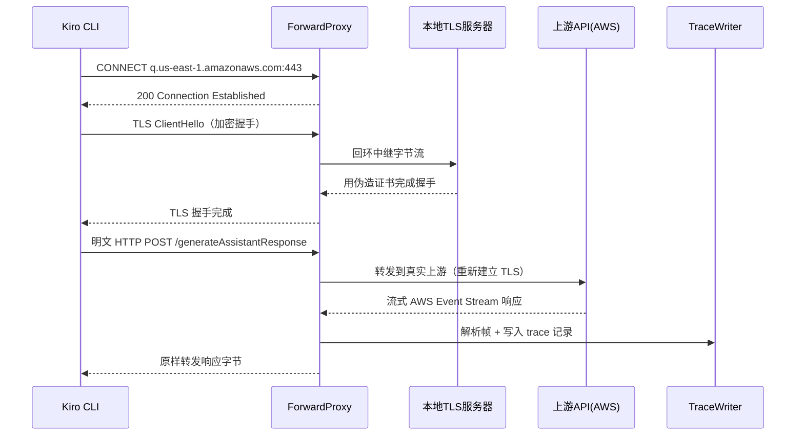
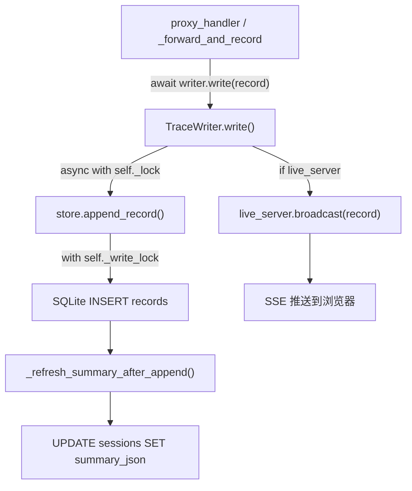

> **注：** 本文档由 **claude-sonnet-4-6** 模型自动生成。

# 📖 kiro-tap 源码全景解析

## 🌟 小白导读

**一句话大白话：** kiro-tap 就像一个"透明玻璃管道"，把 Kiro AI 工具发出的所有 HTTPS 请求都截下来看一眼、记录下来，再原封不动地转发出去——你完全不用改 Kiro 的任何配置。

**生活类比：** 想象你在餐厅点菜，服务员（Kiro CLI）把你的订单传给厨房（AWS API）。kiro-tap 就是一个悄悄站在旁边的"速记员"，把每一张订单和厨房回传的菜单都抄下来，存进笔记本，还能随时翻给你看——而服务员和厨房完全不知道有人在记录。

**读前预期：**
- 读完"架构全景"后，你将能理解：两种代理模式（正向/反向）的区别，以及为什么 Kiro 必须用正向代理
- 读完"源码剥洋葱"后，你将能看懂：AWS Event Stream 二进制帧如何被解析成可读的 JSON 响应
- 读完"难点突破"后，你将彻底搞清楚：TLS 中间人拦截的本地回环实现，以及 SSE 流式重建的状态机逻辑

---

## 📋 目录
- [项目概述与技术栈](#项目概述与技术栈)
- [目录结构](#目录结构)
- [架构全景（附生活类比）](#架构全景附生活类比)
- [入口与初始化流程](#入口与初始化流程)
- [关键业务流程图解](#关键业务流程图解)
- [核心源码剥洋葱（三层深度）](#核心源码剥洋葱三层深度)
- [错误处理与安全边界](#错误处理与安全边界)
- [关键类型与接口定义](#关键类型与接口定义)
- [难点突破（逐个攻克）](#难点突破逐个攻克)
- [为什么要这样设计？](#为什么要这样设计)
- [避坑指南](#避坑指南)

---

## 🎯 项目概述与技术栈

kiro-tap 是一个本地代理与请求追踪工具，专为 Kiro CLI 和 Kiro IDE 设计。它通过拦截所有 HTTPS 流量，完整记录系统提示词、对话历史、工具定义、工具调用、流式响应和 Token 用量，帮助开发者理解 Kiro 的上下文工程实现。所有数据存储在本地 SQLite 数据库，通过内置 Web Dashboard 实时可视化。

**技术栈：**

| 技术/库 | 版本 | 在本项目中的具体角色 |
|---|---|---|
| Python | 3.11+ | 运行时，使用 asyncio 事件循环驱动整个代理服务器 |
| aiohttp | >=3.9,<4 | 双重角色：作为 HTTP 服务器接收客户端请求；作为 HTTP 客户端转发到上游 API |
| cryptography | >=42.0 | 动态生成本地 CA 证书和每个域名的 TLS 证书，实现 HTTPS 中间人拦截 |
| backports-zstd | >=1.0 | 解压 zstd 编码的响应体（AWS API 有时使用此压缩格式） |
| SQLite3 | 内置 | 持久化所有 trace 会话、API 记录和代理日志，WAL 模式支持并发读写 |
| setuptools-scm | >=8.0 | 从 git tag 自动推导版本号，无需手动维护 `__version__` |

**核心特性：**
- 正向代理模式（CONNECT + TLS 终止）：无需修改 Kiro 配置，通过注入 `HTTPS_PROXY` 环境变量拦截所有流量
- AWS Event Stream 原生解析：完整实现二进制帧协议（CRC32 校验 + 9 种 Header 类型），还原 Kiro 的流式响应
- 实时 Dashboard：基于 SSE 的浏览器实时推送，多个 kiro-tap 实例共享同一个 Dashboard 进程
- 多协议支持：HTTP/HTTPS、WebSocket/WSS、SSE 流式响应全覆盖
- 零云端依赖：所有数据本地存储，敏感 Header 自动脱敏后再持久化

---

## 📂 目录结构

```
kiro_tap/
  ├─ __main__.py          # python -m kiro_tap 入口，委托给 cli.main_entry
  ├─ __init__.py          # 公开 API 导出，定义 __all__
  ├─ cli.py               # CLI 解析、async_main 主流程、子命令分发
  ├─ proxy.py             # 反向代理 handler：HTTP 请求拦截、转发、记录
  ├─ forward_proxy.py     # 正向代理服务器：CONNECT 隧道 + TLS 终止 + WS 中继
  ├─ certs.py             # CA 证书生成、per-host 证书缓存、macOS 钥匙串信任
  ├─ sse.py               # SSE 流式重建：将碎片化 SSE 事件拼装成完整响应快照
  ├─ aws_event_stream.py  # AWS Event Stream 二进制帧解析器（Kiro 专用协议）
  ├─ ws_proxy.py          # WebSocket 双向中继 + 消息记录
  ├─ trace.py             # TraceWriter：异步写入 SQLite + 统计 Token 用量
  ├─ trace_store.py       # TraceStore：SQLite 持久化层，Schema v3，线程安全
  ├─ trace_log_handler.py # SQLiteLogHandler：将 Python logging 写入 SQLite
  ├─ live.py              # LiveViewerServer：SSE Dashboard HTTP 服务器
  ├─ shared_dashboard.py  # 共享 Dashboard 进程管理（文件锁 + 子进程生命周期）
  ├─ dashboard.py         # 会话摘要计算、Agent 推断、内容预览提取
  ├─ usage.py             # Token 用量字段归一化（兼容 Anthropic/OpenAI/Gemini）
  ├─ export.py            # 导出子命令：JSONL → Markdown / JSON / HTML
  ├─ viewer.py            # HTML 查看器生成：嵌入 JSONL 数据到自包含 HTML
  ├─ history.py           # 历史记录管理：清理旧会话、迁移旧版 JSONL 文件
  ├─ viewer.html          # 前端查看器模板（零外部依赖的单文件 SPA）
  └─ dashboard.html       # Dashboard 前端模板
tests/
  ├─ conftest.py          # pytest 配置，--run-real-e2e 开关
  ├─ test_aws_event_stream.py  # AWS Event Stream 帧解析单元测试
  ├─ test_kiro_launch.py       # CLI 启动集成测试
  └─ test_path_allowlist.py    # 路径白名单过滤单元测试
```

---

## 🏗️ 架构全景（附生活类比）

### 核心模块 1：ForwardProxyServer（正向代理服务器）

**🗣️ 第一层 — 大白话**
- **它是啥**：一个监听本地端口的 TCP 服务器，实现 HTTP CONNECT 隧道协议，并对 HTTPS 流量做 TLS 中间人拦截
- **通俗点说**：就像海关检查站——所有出境货物（HTTPS 请求）都必须经过这里，检查员（kiro-tap）打开箱子看一眼、拍照留档，然后重新封箱放行，目的地完全不知道被检查过
- **没有它会怎样**：Kiro CLI 不暴露 base URL 环境变量，无法用反向代理模式拦截，只能靠正向代理 + TLS 终止才能看到加密流量内容

**🔧 第二层 — 技术原理**
- **设计模式**：责任链 + 策略模式。`_handle_client` 读取第一行判断是 CONNECT 还是普通 HTTP，分发到不同处理链
- **为什么用这个模式**：CONNECT 隧道和普通 HTTP 代理的处理逻辑完全不同，策略分发比 if/else 嵌套更清晰
- **数据流链路**：客户端 TCP 连接 → 读取 CONNECT 请求 → 回复 200 → 启动本地 TLS 服务器 → 回环中继 → 读取明文 HTTP → 转发上游 → 记录 trace

**🔬 第三层 — 实现细节**
- **文件位置**：`kiro_tap/forward_proxy.py:127`

```python
# forward_proxy.py:221 - CONNECT 处理核心
async def _handle_connect(self, authority, reader, writer):
    hostname, port = authority.rsplit(":", 1)  # 解析 host:port
    # 消费掉 CONNECT 请求的剩余 headers
    while True:
        line = await asyncio.wait_for(reader.readline(), timeout=10)
        if line in (b"\r\n", b"\n", b""):
            break
    # 告诉客户端隧道已建立
    writer.write(b"HTTP/1.1 200 Connection Established\r\n\r\n")
    await writer.drain()
    # 生成该域名的伪造 TLS 证书
    ssl_ctx = self._ca.make_ssl_context(hostname)
    # 启动本地临时 TLS 服务器（端口 0 = 系统自动分配）
    tls_server = await asyncio.start_server(_accept_tls, "127.0.0.1", 0, ssl=ssl_ctx)
    tls_port = tls_server.sockets[0].getsockname()[1]
    # 用两个 _pipe 协程把客户端流量中继到 TLS 服务器
    relay_task = asyncio.create_task(_pipe(relay_r, writer))
    client_to_relay_task = asyncio.create_task(_pipe(reader, relay_w))
```

> ⚠️ **常见误区**：为什么不直接用 `loop.start_tls()` 升级现有连接？因为 macOS Python 3.11 上 `start_tls()` 存在已知 bug，本地回环方案更可靠。

---

### 核心模块 2：SSEReassembler（流式响应重建器）

**🗣️ 第一层 — 大白话**
- **它是啥**：把 AI 模型流式输出的碎片化 SSE 事件（每次几个 token）拼装成一个完整的响应 JSON 对象
- **通俗点说**：就像把一封被撕碎的信（流式 token）按顺序拼回去，最终得到完整的一封信（完整响应）
- **没有它会怎样**：trace 里只有一堆碎片事件，无法直接看到完整的 AI 回复内容和 token 用量

**🔧 第二层 — 技术原理**
- **设计模式**：状态机累加器。每个 SSE 事件类型对应不同的状态转换操作
- **为什么用这个模式**：Anthropic 的流式协议有严格的事件顺序（`message_start` → `content_block_start` → `content_block_delta` × N → `content_block_stop` → `message_delta` → `message_stop`），状态机天然适合这种有序协议
- **数据流链路**：原始字节 → `feed_bytes()` 按行分割 → `_feed_line()` 解析 SSE 格式 → `add_event()` 分发 → `_accumulate()` 更新快照 → `reconstruct()` 返回完整对象

**🔬 第三层 — 实现细节**
- **文件位置**：`kiro_tap/sse.py:11`

```python
# sse.py:67 - 核心状态机
def _accumulate(self, event_type: str, data) -> None:
    if event_type == "message_start":
        self._snapshot = copy.deepcopy(data.get("message", {}))  # 初始化快照
    elif event_type == "content_block_start":
        idx = data.get("index", len(self._snapshot["content"]))
        self._snapshot["content"][idx] = copy.deepcopy(data.get("content_block", {}))
    elif event_type == "content_block_delta":
        delta = data.get("delta", {})
        block = self._snapshot["content"][data.get("index", 0)]
        if delta.get("type") == "text_delta":
            block["text"] = block.get("text", "") + delta.get("text", "")  # 追加文本
    elif event_type == "content_block_stop":
        block = self._snapshot["content"][data.get("index", 0)]
        if "_partial_json" in block:
            block["input"] = json.loads(block["_partial_json"])  # 解析工具调用参数
            del block["_partial_json"]
```

> ⚠️ **常见误区**：`_partial_json` 是内部临时字段，工具调用的 `arguments` 是逐 token 流式到达的，必须等 `content_block_stop` 才能完整解析 JSON。

---

### 核心模块 3：AWSEventStreamReassembler（AWS 二进制帧解析器）

**🗣️ 第一层 — 大白话**
- **它是啥**：解析 Kiro API 使用的 AWS Event Stream 二进制协议，这是一种带 CRC 校验的二进制帧格式，不是普通的文本 SSE
- **通俗点说**：普通 SSE 是明文信件，AWS Event Stream 是加了防伪印章的密封包裹——必须先验证印章（CRC32），再拆开包裹（解析帧头），才能读到里面的内容
- **没有它会怎样**：Kiro 的响应是乱码二进制，完全无法理解 AI 在说什么

**🔧 第二层 — 技术原理**
- **设计模式**：流式解析器 + 累加器。`feed_bytes()` 持续接收字节，`_drain()` 尝试从缓冲区解析完整帧
- **帧格式**：`总长度(4B) + 头部长度(4B) + 前导CRC(4B) + 头部(变长) + 载荷(变长) + 消息CRC(4B)`
- **数据流链路**：原始字节 → 缓冲区 → `parse_frame()` 验证 CRC + 解析头部 → `_process_event()` 按事件类型分发 → 累加文本/工具调用/计量数据 → `reconstruct()` 返回统一格式快照

**🔬 第三层 — 实现细节**
- **文件位置**：`kiro_tap/aws_event_stream.py:173`

```python
# aws_event_stream.py:173 - 帧解析核心
def parse_frame(buffer: bytes) -> tuple[Frame, int] | None:
    total_length = struct.unpack_from(">I", buffer, 0)[0]   # 大端序 4 字节总长
    header_length = struct.unpack_from(">I", buffer, 4)[0]  # 头部区域长度
    prelude_crc = struct.unpack_from(">I", buffer, 8)[0]    # 前导 CRC（校验前 8 字节）
    if len(buffer) < total_length:
        return None  # 数据不完整，等待更多字节
    actual_prelude_crc = _crc32(buffer[:8])
    if actual_prelude_crc != prelude_crc:
        raise ValueError("Prelude CRC mismatch")  # 数据损坏
    message_crc = struct.unpack_from(">I", buffer, total_length - 4)[0]
    actual_message_crc = _crc32(buffer[:total_length - 4])
    if actual_message_crc != message_crc:
        raise ValueError("Message CRC mismatch")  # 消息完整性校验失败
    headers = _parse_headers(buffer[PRELUDE_SIZE:PRELUDE_SIZE + header_length])
    payload = buffer[PRELUDE_SIZE + header_length:total_length - 4]
    return Frame(headers=headers, payload=payload), total_length
```

> ⚠️ **常见误区**：`total_length` 包含了自身的 4 字节，所以载荷结束位置是 `total_length - 4`（减去消息 CRC），不是 `total_length`。

---

## 🚀 入口与初始化流程

程序入口是 `kiro_tap/cli.py:main_entry()`，它先做子命令分发，再进入主流程 `async_main()`。

```python
# cli.py:1026 - 入口分发
def main_entry() -> None:
    if len(sys.argv) > 1 and sys.argv[1] == "export":
        sys.exit(export_main(sys.argv[2:]))      # 导出子命令，同步执行
    if len(sys.argv) > 1 and sys.argv[1] == "dashboard":
        args = parse_dashboard_args(sys.argv[2:])
        code = asyncio.run(dashboard_main(args)) # Dashboard 子命令
        sys.exit(code)
    args = parse_args()                          # 主命令：解析 --tap-* 参数
    code = asyncio.run(async_main(args))         # 进入异步主流程
    sys.exit(code)
```

`async_main()` 的初始化顺序至关重要，每步都有依赖关系：

1. **创建输出目录 + 迁移旧版 JSONL**：`migrate_legacy_traces()` 把旧格式文件导入 SQLite，只执行一次
2. **生成/加载 CA 证书**（仅正向代理模式）：`ensure_ca()` 在 `~/.kiro-tap/` 生成自签名 CA，进程重启后复用
3. **创建 SQLite 会话**：`store.create_session()` 返回 `session_id`，后续所有记录都挂在这个 ID 下
4. **启动共享 Dashboard**：`ensure_shared_dashboard()` 检查端口 19528 是否已有 Dashboard 进程，没有则 fork 子进程
5. **初始化 TraceWriter**：绑定 `session_id`，后续所有 trace 记录通过它写入
6. **配置 SQLiteLogHandler**：把 Python `logging` 的输出重定向到 SQLite，避免污染 Kiro TUI 的终端
7. **启动代理服务器**：正向模式启动 `ForwardProxyServer`，反向模式启动 `aiohttp` Web 应用
8. **启动 Kiro 子进程**：`run_client()` 注入代理环境变量后 `exec` Kiro CLI

---

## 🗺️ 关键业务流程图解

### 流程一：正向代理 HTTPS 拦截全链路



**👆 流程大白话翻译：**
1. Kiro 说"我要连接 AWS 服务器"，代理说"好，隧道建好了"
2. Kiro 开始 TLS 握手，代理用伪造的 AWS 证书骗过 Kiro（Kiro 信任本地 CA）
3. Kiro 在"加密隧道"里发送明文请求，代理能看到全部内容
4. 代理把请求转发给真实 AWS，同时把响应记录下来
5. Kiro 收到响应，完全不知道中间有人看过

**🔍 最难理解的点**：为什么需要"本地回环"而不是直接升级 TLS？因为 `asyncio.start_server` 的 `ssl=` 参数只能在新连接上生效，无法在已有 TCP 连接上动态插入 TLS 层。本地回环方案通过在 `127.0.0.1:0` 启动临时 TLS 服务器，再用两个 `_pipe` 协程把原始连接的字节流中继过去，绕开了这个限制。

---

### 流程二：TraceWriter 异步写入链路



**👆 流程大白话翻译：**
- 每次 API 调用完成后，`TraceWriter` 先用 `asyncio.Lock` 保证同一时刻只有一个协程写 SQLite
- 写完记录后立即更新会话摘要（token 统计、状态等），避免查询时重新扫描所有记录
- 同时通过 SSE 把新记录推送给所有打开 Dashboard 的浏览器标签页

---

## 🔍 核心源码剥洋葱（三层深度）

### 解析一：proxy_handler — 反向代理请求处理

**📍 文件位置**：`kiro_tap/proxy.py:166`

**第一层看懂它**：这是反向代理模式的核心 handler，每个进来的 HTTP 请求都经过它。它负责路径白名单过滤、WebSocket 升级检测、请求转发，以及根据是否流式选择不同的响应处理路径。

```python
# proxy.py:166
async def proxy_handler(request: web.Request) -> web.StreamResponse:
    ctx = request.app["trace_ctx"]                          # 💡 从 app 上下文取配置
    if not _is_allowed_path(request.path, extra_prefixes): # 💡 路径白名单：拒绝扫描器
        return web.Response(status=404, text="Not Found")
    if request.headers.get("Upgrade", "").lower() == "websocket":
        return await _handle_websocket(request)            # 💡 WS 升级走独立路径
    body = await request.read()                            # 💡 aiohttp 已自动解压缩
    fwd_headers["Accept-Encoding"] = "identity"            # 💡 强制上游返回未压缩内容
    upstream_resp = await session.request(...)             # 💡 转发到真实上游
    if is_streaming and upstream_resp.status == 200:
        return await _handle_streaming(...)                # 💡 流式：边转发边解析 SSE
    return await _handle_non_streaming(...)                # 💡 非流式：读完再记录
```

**第二层搞清楚它**：
- **为什么强制 `Accept-Encoding: identity`**：aiohttp 客户端默认请求 gzip/zstd，但上游返回压缩内容后，代理需要解压才能解析 SSE 事件。强制 identity 省去了解压步骤，也避免了 zstd 在某些 Python 版本上的兼容问题
- **为什么不能用更简单的写法**：流式响应必须边接收边转发（`iter_any()`），不能等全部接收完再转发，否则客户端会超时

**第三层吃透它**：
- **最关键的一行**：`fwd_headers["Accept-Encoding"] = "identity"`，因为这决定了后续 SSE 解析是否能正常工作
- **底层追踪**：`proxy_handler` → `_handle_streaming` → `SSEReassembler.feed_bytes()` → `_accumulate()` → `reconstruct()`

---

### 解析二：TraceStore._connect — 线程安全的 SQLite 连接管理

**📍 文件位置**：`kiro_tap/trace_store.py:660`

**第一层看懂它**：SQLite 连接不能跨线程共享，这里用 `threading.local()` 给每个线程维护独立连接，同时用双重检查锁保证 Schema 只初始化一次。

```python
# trace_store.py:660
def _connect(self) -> sqlite3.Connection:
    conn = getattr(self._tls, "conn", None)  # 💡 从线程本地存储取连接
    if conn is None:
        conn = self._open_connection()        # 💡 新线程首次调用才创建连接
        self._ensure_schema_once(conn)        # 💡 Schema 初始化（全局只做一次）
        self._tls.conn = conn                 # 💡 存回线程本地，下次直接复用
    return conn

def _open_connection(self) -> sqlite3.Connection:
    conn = sqlite3.connect(self.db_path)
    conn.execute("PRAGMA journal_mode = WAL")  # 💡 WAL 模式：读写不互斥
    conn.execute("PRAGMA busy_timeout = 5000") # 💡 写锁等待 5 秒再报错
    conn.execute("PRAGMA foreign_keys = ON")   # 💡 启用外键级联删除
    return conn
```

**第二层搞清楚它**：
- **WAL 模式的意义**：Dashboard 进程读取历史记录时，代理进程仍在写入新记录，WAL 允许并发读写不阻塞
- **为什么用 `threading.local` 而不是连接池**：SQLite 的连接对象本身不是线程安全的，`threading.local` 是最简单的隔离方案

**第三层吃透它**：
- **最关键的一行**：`PRAGMA journal_mode = WAL`，没有它多进程并发访问会频繁出现 `database is locked` 错误
- **底层追踪**：`TraceWriter.write()` → `store.append_record()` → `_write_lock` → `_connect()` → `threading.local` → SQLite

---

## 🛡️ 错误处理与安全边界

### 错误处理策略

kiro-tap 采用"不崩溃优先"原则：代理层的任何错误都不能影响 Kiro 客户端的正常使用。

```python
# proxy.py:253 - 上游连接失败处理
try:
    upstream_resp = await session.request(...)
except Exception as exc:
    log.error(f"{log_prefix} upstream error: {exc}")
    return web.Response(status=502, text=str(exc))  # 💡 返回 502，不抛出异常
```

```python
# forward_proxy.py:207 - 客户端连接异常静默处理
except (ConnectionError, asyncio.TimeoutError, asyncio.CancelledError):
    pass  # 💡 客户端断开是正常情况，不记录错误日志
except Exception:
    log.exception("Error handling forward proxy connection")  # 💡 意外错误才记录
```

**关键设计**：流式响应中途断开（`ConnectionError`、`CancelledError`）被静默处理，因为用户关闭 Kiro 时这是正常行为。只有真正意外的异常才会记录到日志。

### 边界输入校验

**路径白名单**（`proxy.py:85`）：只允许已知 AI API 路径通过，拒绝所有其他路径（返回 404）。这防止了扫描器/爬虫把代理当作开放代理使用。

```python
ALLOWED_PATH_PREFIXES = (
    "/generateAssistantResponse",  # Kiro 专用
    "/v1/messages",                # Anthropic
    "/v1/chat/completions",        # OpenAI
    "/v1beta/models",              # Gemini
    # ...省略: 其他已知 AI API 路径
)
```

**DeepSeek user_id 归一化**（`proxy.py:140`）：DeepSeek 的 Anthropic 兼容 API 对 `metadata.user_id` 有格式限制（只允许 `[a-zA-Z0-9_-]`），kiro-tap 自动将不合规的 user_id 替换为其 SHA-256 摘要前 24 位，避免上游 400 错误。

### 安全相关逻辑

**敏感 Header 脱敏**（`proxy.py:43`）：`Authorization`、`Cookie`、`x-api-key` 等敏感 Header 在写入 trace 前自动替换为 `***`（或保留前 12 字符 + `...`），防止 token 泄露到 trace 文件。

```python
SENSITIVE_HEADER_KEYS = frozenset({
    "authorization", "cookie", "x-api-key",
    "cosy-key", "cosy-machinetoken",  # 💡 Kiro 运行时特有的机器标识 Header
    "cosy-machineid", "cosy-user",
})
```

**CA 私钥权限**（`certs.py:104`）：CA 私钥文件写入后立即设置 `chmod 0o600`，防止其他用户读取。

**本地绑定**（`cli.py:796`）：默认绑定 `127.0.0.1`，只有 `--tap-no-launch` 模式（代理独立运行）才绑定 `0.0.0.0`，避免意外暴露到局域网。

---

## 📐 关键类型与接口定义

```python
# cli.py:67 - 客户端配置数据类
@dataclass(frozen=True)
class ClientConfig:
    cmd: str                    # 可执行文件名（如 kiro-cli-chat）
    base_url_env: str           # 反向代理模式注入的环境变量名
    default_target: str         # 默认上游 API URL
    default_proxy_mode: str     # 默认代理模式（forward/reverse）
    strip_path_prefix: str      # 路径前缀剥离（如 /v1 → /）
    forward_base_url_envs: tuple[str, ...]  # 正向代理模式额外注入的 URL 环境变量
```

```python
# aws_event_stream.py:62 - AWS 帧数据类
@dataclass
class Frame:
    headers: dict[str, object]  # 解析后的帧头（:message-type, :event-type 等）
    payload: bytes              # 帧载荷（通常是 JSON）
```

| 概念/接口名 | 文件位置 | 在业务中代表什么 |
|---|---|---|
| `ClientConfig` | `cli.py:67` | 每种 AI 客户端工具的代理配置模板，决定如何注入环境变量 |
| `TraceWriter` | `trace.py:15` | 一次 kiro-tap 运行会话的写入句柄，持有 session_id 和 token 统计 |
| `TraceStore` | `trace_store.py:56` | 进程级 SQLite 单例，所有会话/记录/日志的持久化入口 |
| `ForwardProxyServer` | `forward_proxy.py:127` | 正向代理服务器实例，管理所有客户端连接的生命周期 |
| `CertificateAuthority` | `certs.py:183` | 内存中的 CA，按需生成并缓存每个域名的 TLS 证书 |
| `SSEReassembler` | `sse.py:11` | 流式响应重建器，支持 Anthropic/OpenAI/Gemini 三种协议格式 |
| `AWSEventStreamReassembler` | `aws_event_stream.py:267` | Kiro 专用的 AWS 二进制帧解析器，输出与 SSEReassembler 兼容的快照格式 |
| `LiveViewerServer` | `live.py:52` | Dashboard HTTP 服务器，提供 SSE 实时推送和 REST API |
| `Frame` | `aws_event_stream.py:62` | 一个完整的 AWS Event Stream 帧，含解析后的头部和载荷 |

---

## 🧩 难点突破（逐个攻克）

### 难点 1：TLS 中间人拦截的本地回环实现

**🤔 难在哪里**：asyncio 无法在已有 TCP 连接上动态插入 TLS 层，必须用迂回方案

**💡 心智模型**：
就像你想在一条已经铺好的水管中间加一个过滤器，但水管不能断开。解决方案是：在旁边建一个新的过滤站（本地 TLS 服务器），把水管的出口接到过滤站入口，过滤站出口再接回原来的目的地——水流方向不变，但中间多了一个检查点。

**🔗 实现追踪**：
```
Kiro 发送 CONNECT 请求
  └─ ForwardProxyServer._handle_connect()
      └─ 回复 200 Connection Established
          └─ asyncio.start_server(_accept_tls, "127.0.0.1", 0, ssl=ssl_ctx)
              └─ 启动临时 TLS 服务器，端口 0（系统自动分配）
                  └─ asyncio.open_connection("127.0.0.1", tls_port)
                      └─ 两个 _pipe 协程：client↔relay_w, relay_r↔writer
                          └─ TLS 握手在 127.0.0.1 上完成
                              └─ _handle_tunneled_requests() 读取明文 HTTP
```

**⚠️ 常见陷阱**：
- 陷阱1：忘记等待 `connected.wait()` 就关闭 `tls_server`，导致 TLS 握手还没完成就断开
- 陷阱2：`relay_task` 和 `client_to_relay_task` 必须都取消后再 `gather`，否则会有协程泄漏

**✅ 正确姿势**：
```python
await asyncio.wait_for(connected.wait(), timeout=15)  # 等握手完成
tls_server.close()  # 关闭监听，但已建立的连接不受影响
tls_reader = tls_reader_holder[0]  # 取出握手后的 reader
await self._handle_tunneled_requests(hostname, port, tls_reader, tls_writer)
```

---

### 难点 2：AWS Event Stream 二进制帧的流式解析

**🤔 难在哪里**：二进制帧可能跨越多个 TCP 包到达，必须处理"半帧"情况；同时 CRC 校验失败时需要逐字节重新同步

**💡 心智模型**：
就像收到一箱被随机切割的拼图碎片（TCP 包），每次收到一些碎片就尝试拼出完整的一块（帧）。如果碎片不够，就先存起来等下一批；如果发现某块拼图损坏（CRC 失败），就跳过一个字节重新找帧头。

**🔗 实现追踪**：
```
upstream_resp.content.iter_any() → 原始字节块
  └─ AWSEventStreamReassembler.feed_bytes(chunk)
      └─ self._buf += chunk  ← 追加到缓冲区
          └─ _drain()
              └─ parse_frame(self._buf[offset:])
                  ├─ 返回 None → 数据不完整，等待更多字节
                  ├─ 抛出 ValueError → CRC 失败，offset += 1 重新同步
                  └─ 返回 (Frame, consumed) → 处理帧，offset += consumed
```

**⚠️ 常见陷阱**：
- 陷阱1：直接 `self._buf = b""` 清空缓冲区，而不是 `self._buf = self._buf[offset:]`，会丢失未处理的字节
- 陷阱2：`total_length` 是包含自身的总长度，载荷区间是 `[PRELUDE_SIZE + header_length : total_length - 4]`，差一字节就解析出乱码

**✅ 正确姿势**：
```python
def _drain(self) -> None:
    offset = 0
    while offset < len(self._buf):
        try:
            result = parse_frame(self._buf[offset:])
        except ValueError:
            offset += 1  # CRC 失败：跳过一字节重新同步
            continue
        if result is None:
            break        # 数据不完整：等待更多字节
        frame, consumed = result
        self._process_frame(frame)
        offset += consumed
    self._buf = self._buf[offset:]  # 保留未处理的尾部字节
```

---

### 难点 3：共享 Dashboard 的多进程竞争启动

**🤔 难在哪里**：多个 kiro-tap 实例同时启动时，可能同时检测到 Dashboard 未运行，然后同时 fork 子进程，导致端口冲突

**💡 心智模型**：
就像多个人同时发现办公室没有咖啡，都去煮咖啡——结果煮了一堆没人喝。解决方案是在咖啡机旁边放一把锁，谁拿到锁谁去煮，其他人等着喝。

**🔗 实现追踪**：
```
ensure_shared_dashboard()
  └─ is_dashboard_healthy() → False（Dashboard 未运行）
      └─ asyncio.to_thread(_spawn_dashboard_subprocess_if_needed)
          └─ _dashboard_spawn_lock()  ← 文件锁（fcntl.flock / msvcrt.locking）
              └─ _sync_dashboard_healthy_for_current_db()  ← 锁内再次检查
                  ├─ 已有其他进程启动了 → 直接返回 False
                  └─ 确实没有 → _spawn_dashboard_subprocess() fork 子进程
```

**⚠️ 常见陷阱**：
- 陷阱1：只检查一次健康状态就 fork，没有在锁内二次确认，导致多个进程同时 fork
- 陷阱2：Dashboard 子进程用 `start_new_session=True` 脱离父进程组，但父进程退出后 Dashboard 继续运行——这是设计意图，但调试时容易困惑

**✅ 正确姿势**：双重检查锁（先异步检查，再在文件锁内同步检查）

---

### 难点 4：OpenAI Chat Completions 流式格式的跨协议兼容

**🤔 难在哪里**：OpenAI Chat Completions 的 SSE 格式与 Anthropic 完全不同——没有 `event:` 行，只有裸 `data:` 行；工具调用参数是逐 token 流式到达的索引化 delta

**💡 心智模型**：
Anthropic 的流式协议像有编号的快递（`event: content_block_delta`），每个包裹都标明是第几号内容的第几个增量。OpenAI 的协议像没有标签的散装货（裸 `data:`），只有一个 `choices[0].delta` 字段，工具调用还要按 `index` 自己拼装。

**🔗 实现追踪**：
```
SSEReassembler._feed_line()
  └─ event_type = self._current_event or "message"  ← 无 event: 行时默认 "message"
      └─ add_event("message", data)
          └─ _accumulate("message", data)
              └─ if "choices" in data:
                  └─ _accumulate_chat_completion_chunk(data)
                      └─ 按 tool_calls[idx] 累加 function.arguments
                          └─ _mirror_tool_call_to_content()  ← 同步到 Anthropic 格式的 content 数组
```

**⚠️ 常见陷阱**：
- 陷阱1：`choices[0].delta.tool_calls` 是增量数组，`arguments` 字段是逐 token 追加的字符串，必须等所有 chunk 到齐才能 `json.loads()`
- 陷阱2：某些提供商发送最终 usage-only chunk（`{"choices": [], "usage": {...}}`），必须单独处理，不能当作普通 delta

---

## 🎯 为什么要这样设计？（架构师碎碎念）

### 设计决策一：为什么默认用正向代理而不是反向代理？

- **当时面临的问题**：Kiro CLI 没有暴露 `KIRO_BASE_URL` 之类的环境变量，无法通过修改 base URL 把请求重定向到本地反向代理
- **有哪些备选方案**：
  - 方案A：反向代理（修改 base URL 环境变量）——Kiro 不支持
  - 方案B：正向代理（注入 `HTTPS_PROXY`）——需要 TLS 终止，但通用性强
  - 方案C：eBPF/网络层拦截——需要 root 权限，不适合开发工具
- **最终选择的理由**：正向代理是唯一不需要修改 Kiro 源码、不需要 root 权限的方案；`HTTPS_PROXY` 是所有主流 HTTP 客户端都支持的标准环境变量
- **这个选择的代价**：需要生成本地 CA 证书并让客户端信任，macOS 上首次运行需要用户手动执行 `kiro-tap trust-ca`

### 设计决策二：为什么用 SQLite 而不是 JSONL 文件？

- **当时面临的问题**：旧版用 JSONL 文件，多个 kiro-tap 实例并发写入同一目录时会产生文件名冲突；Dashboard 需要跨文件聚合查询
- **有哪些备选方案**：
  - 方案A：继续用 JSONL，加文件锁——并发写入仍然复杂
  - 方案B：SQLite WAL 模式——天然支持多写入者，SQL 查询灵活
  - 方案C：PostgreSQL/Redis——对本地工具来说过重
- **最终选择的理由**：SQLite WAL 模式支持多进程并发读写，单文件便于备份和分享，Python 内置支持无需额外依赖
- **这个选择的代价**：Schema 迁移需要手动管理版本（当前 v3），旧版 JSONL 文件需要一次性迁移

### 设计决策三：为什么 SSEReassembler 同时支持 Anthropic/OpenAI/Gemini 三种格式？

- **当时面临的问题**：用户可能通过 kiro-tap 代理其他 AI 工具（Claude Code、Codex CLI 等），这些工具使用不同的流式协议
- **有哪些备选方案**：
  - 方案A：每种协议独立的 Reassembler 类——代码重复，viewer 需要多套渲染逻辑
  - 方案B：统一 Reassembler，内部按协议分支——复杂但 viewer 只需一套逻辑
- **最终选择的理由**：viewer.html 只需要理解一种输出格式（Anthropic 的 `content` 数组），所有协议都归一化到这个格式
- **这个选择的代价**：`_accumulate_chat_completion_chunk()` 的镜像逻辑（把 OpenAI 格式同步到 Anthropic 格式的 `content` 数组）增加了代码复杂度

---

## ⚠️ 避坑指南

### 潜在风险

- **风险1：CA 证书过期** → CA 有效期 5 年，host 证书 1 年。到期后 Kiro 会报 TLS 错误。**如何规避**：删除 `~/.kiro-tap/ca.pem` 和 `ca-key.pem`，重新运行 kiro-tap 自动重新生成，然后重新执行 `kiro-tap trust-ca`

- **风险2：SQLite 数据库损坏**（进程被强制 kill 时）→ WAL 模式下概率极低，但仍可能发生。**如何规避**：数据库路径在 `~/.local/share/kiro-tap/traces.sqlite3`，损坏时删除重建即可，历史数据会丢失

- **风险3：Dashboard 端口 19528 被占用** → 启动时报 `OSError: [Errno 48] Address already in use`。**如何规避**：用 `--tap-live-port` 指定其他端口，或设置环境变量 `KIROTAP_DASHBOARD_PORT`

- **风险4：`--tap-allow-path /` 过于宽泛** → CLI 已明确拒绝此配置（`error: --tap-allow-path '/' is too broad`），但自定义路径前缀仍需谨慎，避免把代理变成开放代理

- **风险5：多线程写入竞争** → `TraceStore` 用 `_write_lock`（`threading.Lock`）保护所有写操作，但 `TraceWriter.write()` 用的是 `asyncio.Lock`。两者不能混用——异步代码必须用 `asyncio.Lock`，同步代码用 `threading.Lock`

### 优化建议

- **建议1**：`_watch_dashboard_store()` 每秒轮询 SQLite 检测变化（`dashboard_snapshot()`），高频写入时会产生大量无效查询。可改为 SQLite 的 `update_hook` 回调或使用 `inotify`/`FSEvents` 监听文件变化
- **建议2**：`CertificateAuthority._host_cache` 是进程内内存缓存，进程重启后需要重新生成所有 host 证书。可持久化到磁盘（加密存储）减少重启开销
- **建议3**：`viewer.html` 超过 50 条记录时切换到 lazy 模式（从 `<script type="text/plain">` 按需解析），但元数据提取（`_extract_metadata()`）仍在 Python 侧全量执行。大型 trace（数百条记录）时生成 HTML 会有明显延迟，可考虑流式写入
